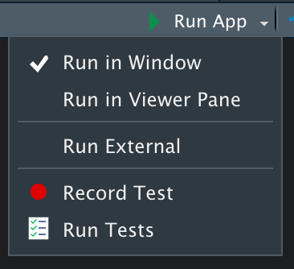

# Workflow {#action-workflow}

```{r, include = FALSE}
source("common.R")
```

If you're going to be writing a lot of Shiny apps (and since you're reading this book you hopefully will be!), it's worth investing some time in your basic app workflow. Spending a little time to optimise the iteration cycle so that you can make a change and see the results as quickly as possible pays off by making the process more enjoyable, and allows your skills to improve more rapidly.

For all development activities, I strongly recommend that you spend some time optimising your iteration speed. How short can you make the cycle between making a change and seeing the outcome? The fastest you can iterate, the fast you can experiment, and the faster you can become a better Shiny developer.

Similarly, as you develop Shiny apps, you are going to run into problems; situations where the code either unexpectedly errors or doesn't do what you want. It's frustrating when these situations arise, but if you can turn them into opportunities to practice your debugging skills, you'll find that over time your mental model of Shiny improves (so you make fewer mistakes) and you get better at recovering from mistakes when they happen.

## Getting started

I mentioned this earlier in the book, but now's a good to time to review it: there are two ways to create the basic `app.R` template:

```{r, eval = FALSE}
library(shiny)

ui <- fluidPage(
  ...
)

server <- function(input, output, session) {
  
}

shinyApp(ui, server)
```

If you get sick of typing that code in, RStudio provides a couple of shortcuts to help you:

* If you already have your future `app.R` open, type `shinyapp` then press 
  `Shift` + `Tab` to insert the shinyapp snippet.[^snippet]

* If you want to start a new project (i.e. a self-contained directory that is
  isolate from the other projects that you're working on), go to the File menu, 
  select "New Project" then select "Shiny Web Aplication":

    ```{r, echo = FALSE, out.width = NULL}
    knitr::include_graphics("screenshots/action-workflow/new-project.png", dpi = 300)
    ```

You might think it's not worthwhile to learn these shortcuts because you'll only create at most an app or two each day. However, creating simple experimental apps is a great way to check that you have the basic ideas working before you integrate a new feature into a large app. Creating simple apps is also a great tool for debugging as you'll learn shortly. 

[^snippet]: Snippets are text macros that you can use to insert common code fragments. See <https://support.rstudio.com/hc/en-us/articles/204463668-Code-Snippets> for more details.

## Development workflow

The first way to reduce your iteration time is to learn the keyboard shortcut for launching an app: `Cmd/Ctrl` + `Shift` + `Enter`. You can, of course, click the run app button, but I recommend learning the keyboard shortcut because it's faster in the long run. This gives you a basic workflow like:

* Write some code.
* Launch the app with `Cmd/Ctrl` + `Shift` + `Enter`.
* Interactively experiment.
* Close the app.
* Repeat.

Another way to reduce your iteration speed still further is to turn autoreload on (`options(shiny.autoreload = TRUE)`) and then run the app in a background job, as described in <https://github.com/sol-eng/background-jobs/tree/master/shiny-job>. With this workflow as soon as you save a file, your app will relaunch: no needed to close and restart. This leads to an even faster workflow:

* Write some code and press `Cmd/Ctrl` + `S` to save to the file.
* Interactively experiment.
* Repeat.

The chief disadvantage of this technique is that because the app is running in a separate process, it's considerably hard to debug.

As you app gets bigger and bigger you'll find that the "interactively experiment" step starts to become onerous. It's too hard to remember to re-check every component of your app that you might have affected with your changes. Later, you'll learn two tools that help you with this challenge:

* Modules, Chapter \@ref(action-modules), help you isolate parts of your app 
  into self-contained pieces. Modules guarantee isolation between components,
  making it easier to test because a module can only interact with the rest of 
  your in pre-specified ways. 
  
* Automated testing, allows you to turn the interactive experiments you're 
  running into automated code. This lets you run the tests more quickly 
  (because they're automated), and means that you can't forget to run an
  important test.

### View options

By default, when you run the app, it will appear in an pop-out window. There are two other options that you can choose from the Run App drop down:

```{r, echo = FALSE, out.width = NULL}

```

* Running in the viewer pane is useful for smaller apps because you can see it
  at the same time as you run your app code.
  
* Run in an external browser is useful for larger apps, or if you want to
  check your app looks the exactly the way you expect in the context that
  most user will see it.

## Debugging

When you start writing apps, it is almost guaranteed that something will go wrong. As you read this book, you'll learn new skills so that the chances an app works the first time increases, but it takes years of experience in any language before you can reliably write code that works the first time. To solve this problem you need to embrace it: accept that you will make mistakes, and as well as trying to prevent them, ensure that you can gracefully handle them when they arise.

Debugging ordinary R code is hard enough, but Shiny poses additional problems:

* Reactive code is run out of order, so it can be hard to figure out exactly 
  what sequence of actions triggers the problem.
  
* Shiny blocks the console, so it can be harder to explore interactively.

There are three main cases of errors:

* You get an unexpected error. This is the easiest case, because you'll get 
  a traceback which allows you to figure out exatly where the error is coming
  from.
  
* You don't get any errors, but a value is incorrect. Often the best solution 
  is to transform this problem into the first problem by using `stop()` to 
  throw an error when the bad value occurs (you may need to track back across 
  multiple functions).
  
* All the values are correct, but they're not updated when you expect. This
  is the most challenging problem because it's unique to Shiny, so you can't
  use existing skills. I'll show a couple of basic techniques here, but
  we'll need to come back to this challenge after you learn about the 
  full reactive model in detail in Chapter \@ref(reactivity-tracking).

### Reading a call stack

The first challenge is the same in either case: find the exact piece of code where the problem occurs. You should be familiar with the basic tools for debugging regular R code (if you're not, read <https://whattheyforgot.org/debugging-r-code.html>).

Take this very simple app where I've added some indirection:

```{r, eval = FALSE}
library(shiny)

f <- function(x) g(x)
g <- function(x) h(x)
h <- function(x) x * 2

ui <- fluidPage(
  selectInput("n", "N", 1:10),
  plotOutput("plot")
)
server <- function(input, output, session) {
  output$plot <- renderPlot({
    n <- f(input$n)
    plot(head(cars, n))
  })
}
shinyApp(ui, server)
```

To understand the call stack that this produces:

```
Warning: Error in *: non-numeric argument to binary operator
  173: g [~/.active-rstudio-document#4]
  172: f [~/.active-rstudio-document#3]
  171: renderPlot [~/.active-rstudio-document#13]
  169: func
  129: drawPlot
  115: <reactive:plotObj>
   99: drawReactive
   86: origRenderFunc
   85: output$plot
    5: runApp
    3: print.shiny.appobj
    1: source
```

You need to read it upside down:

```
Warning: Error in *: non-numeric argument to binary operator
    1: source
    3: print.shiny.appobj
    5: runApp
   85: output$plot
   86: origRenderFunc
   99: drawReactive
  115: <reactive:plotObj>
  129: drawPlot
  169: func
  171: renderPlot [~/.active-rstudio-document#13]
  172: f [~/.active-rstudio-document#3]
  173: g [~/.active-rstudio-document#4]
```

This tells you the sequence of function calls that lead to the error. There are three basic parts to the call stack:

*   The first few calls start the the app. Here the file is `source()`d, then
    `print.shiny.appobj()` calls `runApp()` to start the app. In general, you 
    can ignore anything before the first `runApp()`; this is just the setup 
    code to get the app running.

    ```
    1: source
    3: print.shiny.appobj
    5: runApp
    ```
    
*   Next, you'll see some internal shiny code in charge of calling the 
    reactive expression. Here, spotting `output$plot` is really important - 
    that tells which of your reactives is causing the error. The next few 
    functions are internal, and you can ignore them.

    ```
     85: output$plot
     86: origRenderFunc
     99: drawReactive
    115: <reactive:plotObj>
    129: drawPlot
    169: func
    ```

*   Your code: this is the code called from inside of the `renderPlot()`. You
    can you should pay attention here because you'll see a file path and line
    number; this lets you know that it's your code.
    
    ```  
    171: renderPlot [~/.active-rstudio-document#13]
    172: f [~/.active-rstudio-document#3]
    173: g [~/.active-rstudio-document#4]
    ```

If you get an error in your app but don't see a traceback then make sure that you're running the app using `Cmd/Ctrl` + `Shift` + `Enter` (or if not in RStudio, calling `runApp()`), and that you've saved the file that you're running it from. Other ways of running the app don't always capture the information necessary to make a call stack.

### The interactive debugger

One of the most useful R features for debugging shiny apps is the ability to pause execution and get an interactive environment where you can inspect the current values of reactive components.  There are two ways to launch this:

* Add `browser()` to the source code. Because it's regular R code, you can 
  condition it behind an if statement.

* Add an RStudio breakpoint. The advantage is you'll never accidentally commit
  this to git.
  
Once you're in this browser

```{r debug-toolbar, echo = FALSE, out.width = "50%", fig.cap = "RStudio debugging toolbar"}
knitr::include_graphics("images/action-workflow/debug-toolbar.png")
```

There three most useful are:

* Next, `n`: executes the next step in the function. If you have a
  variable named `n`, you'll need `print(n)` to display its value.

* Continue, `c`: leaves interactive debugging and continues regular execution
  of the function. This is useful if you've fixed the bad state and want to
  check that the function proceeds correctly.

* Stop, `Q`: stops debugging, terminates the function, and returns to the global
  workspace. Use this once you've figured out where the problem is, and you're
  ready to fix it and reload the code.

As well from stepping through the code line-by-line using these tools, you'll also run a _bunch_ of interactive code to understand why you're seeing the error you see. Debugging is process of systematically comparing your expectations to reality until you find the mismatch.

### Debugging reactivity

Use `message()` to emit messages to the console that allow you to see exactly when code is run. You can put messages in any reactive expression or output, just make sure they're not the last line (otherwise they'll become the value used by the reactive expression or output). 
  
If you're outputting multiple values, you might find the
[glue](http://glue.tidyverse.org/) package useful; it makes it very easy
to create informative text strings.

If the problem is that reactive events aren't triggering as expect, you may find the reactive log, <https://github.com/rstudio/reactlog>, useful. We'll come back to this later (once you've got a more solid understanding of the flow of reactivity), but here's the basic usage:

```{r, eval = FALSE}
library(shiny)
library(reactlog)
options(shiny.reactlog = TRUE)

runApp(ui, server)

# Press Cmd / Ctrl + F3 to launch the react log while you app is running
# Or quit the app and run:
reactlogShow()
```

### Making a reprex

The key challenge of debugging is that typically you have a lot of code that works just fine, and a very small amount of code that's causing problems. The skill of debugging is quickly eliminating the code that works correctly and narrowing in on the problem. The key challenge is that the code that you believe is working correctly is often not; so somehow you have to find and confront your flawed mental model.

If you're in a big app, and you just can't get traction on what's going wrong, I highly recommend spending some time isolating the problem by removing chunks of the app that are unrelated. This is the same process as making a reprex, as described in below, so has the added benefit that if you still can't figure it out, you'll be in a good position to ask for help from others.

This is a technique that I use all the time when debugging packages: start with a big blob of code that illustrates the problem and progressively remove the code that's unrelated. The tighter you can isolate the problem, the less other code that you'll have to look through.

## Getting help {#reprex}

Do you have a problem you can't figure out, or a question that this book (and Google) can't answer? The best place to ask is the Shiny community site,  <https://community.rstudio.com/c/shiny>. This site is read by many Shiny users, as well as the developers of the Shiny package itself. It's also a great place to visit if you want to improve your Shiny skills by helping others.

To get the most useful help as quickly as possible, you must create a reprex, or **repr**oducible **ex**ample. The goal of a reprex is to provide the smallest possible snippet of R code that illustrates the problem and can easily be run on another computer. It's common courtesy (and in your own best interest) to create a reprex: if you want someone to help you, you should make it as easy as possible for them! 

### Reprex basics

A reprex is just some R code that works when you copy and paste it into a R session on another computer. Here's a simple reprex for a Shiny app:

```{r, eval = FALSE}
library(shiny)
ui <- fluidPage(
  selectInput("n", "N", 1:10),
  plotOutput("plot")
)
server <- function(input, output, session) {
  output$plot <- renderPlot({
    n <- input$n * 2
    plot(head(cars, n))
  })
}
shinyApp(ui, server)
```

This code doesn't make any assumptions about the computer on which its running (except that Shiny is installed!) so anyone can run this code and see the problem: the app throws an error saying "non-numeric argument to binary operator". 

Clearly illustrating the problem is the first step to getting help, and because anyone can reproduce the problem by just copying and pasting the code, they can easily explore your code and test possible solutions. (In this case, you need `as.numeric(input$n)` since `selectInput()` creates a string.)

### Making a reprex

The first step in making a reprex is to create a single self-contained file that contains everything needed to run your code. You should check it by starting a fresh R session and then running the code. Make sure you haven't forgotten to load any packages[^library] that make your app work.

[^library]: Regardless of how you normally load packages, I strongly recommend using multiple `library()` calls. This eliminates a source of potential confusion for people who might not be familiar with the tool that you're using.

Typically, the most challenging part of making an app work on another computer is eliminating the use of data that's only stored on your computer. To turn your code into a reprex, you need to provide the needed data inline in the reprex, without assuming that there are any other files on disk. This can be either your original data set, or a simplified version of it that still causes the issue. For example, if you have a data frame with 1,000 rows, you might try to take the first 20 rows and see if that will still cause the problem. In general it is best to provide a simplified version of the data set, so that it is easy for others to understand it.

*   Use a built-in data set like `mtcars` or `iris`.

*   Provide regular R code that generates a data set. For example:

    ```{r}
    mydata <- data.frame(x = 1:5, y = c("a", "b", "c", "d", "e"))
    ```

*   Use `dput()` to turn an existing data frame into executable code.
    `dput(mydata)` generates the code you need to recreate `mydata`:
    
    ```{r}
    dput(mydata)
    ```
  
    Once you have that code, you can put this in your reprex to generate 
    `mydata`:
    
    ```{r}
    mydata <- structure(list(x = 1:5, y = structure(1:5, .Label = c("a", "b", 
    "c", "d", "e"), class = "factor")), class = "data.frame", row.names = c(NA, 
    -5L))
    ```

    If `dput()` on your original data generates too much code, try taking a 
    subset of your data and see if it will reproduce the problem.

If reading data from disk seems to be an irreducible part of the problem, a strategy of last resort is to provide a complete project containing both an `app.R` and the needed data files. The best way to do provide this is as a RStudio project hosted on GitHub, but failing that, you can carefully make a zip file than can be run locally. Make sure that you use relative paths (i.e. `read.csv("my-data.csv"`) not `read.csv("c:\\my-user-name\\files\\my-data.csv")`) so that your code still works when run from a different location.

### Making a minimal reprex

Creating the smallest possible reprex is particularly important for Shiny apps, which can be quite large and complicated. Rather than forcing the person trying to help you to understand all the details of your app, you are more likely to get higher quality help faster if you can extract out the exact piece of the app that you're struggling with. As an added benefit, this process will often lead you to discover what the problem is, so you don't have to wait for help from someone else!

Reducing a bunch of code to the essential problem is a skill, and you probably won't be very good it at first. That's ok! Even the smallest reduction in code complexity helps the person helping you, and over time your compexity reduction skills will approve.

If you don't know what part of your code is triggering the problem, a good way to find it is to remove sections of code from your application, piece by piece, until the problem goes away. If removing a particular piece of code makes the problem stop, it's likely that that code is related to the problem. Alternatively, sometimes it's simpler to start with a fresh, empty, app and progressively build it up until you find the problem again.

Once you've simplified your app to demonstrate the problem, it worthwhile to take a final pass through and check:

* Is every input and output in `UI` related to the problem? 

* Does your app have a complex layout that you can simplify to help focus 
  on the problem at hand?
  
* Have you created reactives in `server()` that aren't pertinent to the 
  problem?
  
* If you've tried multiple ways to solve the problem, have you removed all
  the vestiges of the attempts that didn't work?
  
* Is every package that you load needed to illustrate the problem? Can you
  eliminate packages by replacing functions with dummy code?

### Case study

To illustrate the process of making a top-notch reprex I'm going to use an example from [Scott Novogoratz](https://community.rstudio.com/u/sanovogo) posted on [RStudio community](https://community.rstudio.com/t/37982). The initial code was very close to being a reprex, but wasn't quite reproducible because it forgot to load a pair of packages. At as a starting point: 

* Added missing `library(lubrdate)` and `library(xts)`.
* Split apart `ui` and `server` into separate objects.
* Reformatted with `styler::style_selection()`.

That yielded the following reprex:

```{r, eval = FALSE}
library(xts)
library(lubridate)
library(shiny)

ui <- fluidPage(
  uiOutput("interaction_slider"),
  verbatimTextOutput("breaks")
)
server <- function(input, output, session) {
  df <- data.frame(
    dateTime = c(
      "2019-08-20 16:00:00",
      "2019-08-20 16:00:01",
      "2019-08-20 16:00:02",
      "2019-08-20 16:00:03",
      "2019-08-20 16:00:04",
      "2019-08-20 16:00:05"
    ),
    var1 = c(9, 8, 11, 14, 16, 1),
    var2 = c(3, 4, 15, 12, 11, 19),
    var3 = c(2, 11, 9, 7, 14, 1)
  )

  timeSeries <- as.xts(df[, 2:4], order.by = strptime(df[, 1], format = "%Y-%m-%d %H:%M:%S"))
  print(paste(min(time(timeSeries)), is.POSIXt(min(time(timeSeries))), sep = " "))
  print(paste(max(time(timeSeries)), is.POSIXt(max(time(timeSeries))), sep = " "))

  output$interaction_slider <- renderUI({
    sliderInput(
      "slider",
      "Select Range:",
      min = min(time(timeSeries)),
      max = max(time(timeSeries)),
      value = c(min, max)
    )
  })

  brks <- reactive({
    req(input$slider)
    seq(input$slider[1], input$slider[2], length.out = 10)
  })

  output$breaks <- brks
}
shinyApp(server, ui)
```

If you run this reprex, you'll see the same problem in the initial post: an error starting "Type mismatch for min, max, and value. Each must be Date, POSIXt, or number". This is a solid reprex: I can easily run it on my computer, and it immediately illustrates the problem. However, it's a bit long, so it's not clear what's causing the problem.

To make this reprex simpler we can carefully work through each line of code and see if it's important. While doing this, I discovered:

* Removing the the two lines starting with `print()` didn't affect the error. 
  Those two lines used `lubridate::is.POSIXct()`, which was the only use of 
  lubridate, so once I removed them, I no longer needed to load lubridate.
  
* `df` is a data frame that's converted to an xts data frame called 
  `timeSeries`. But the only way `timeSeries` is used is via 
  `time(timeSeries)` which returns a date-time. So I created
  a new variable `datetime` that contained some dummy date-time data.
  This still yielded the same error, so I removed `timeSeres` and `df`,
  and since that was the only place xts was used, I also removed
  `library(xts)`

Together, those changes yielded a new `server()` that looked like this:

```{r}
datetime <- Sys.time() + (86400 * 0:10)

server <- function(input, output, session) {
  output$interaction_slider <- renderUI({
    sliderInput(
      "slider",
      "Select Range:",
      min   = min(datetime),
      max   = max(datetime),
      value = c(min, max)
    )
  })
  
  brks <- reactive({
    req(input$slider)
    seq(input$slider[1], input$slider[2], length.out = 10)
  })
  
  output$breaks <- brks
}
```

Next, I noticed that this example uses a relatively sophisticated Shiny technique where the UI is generated in the server function. WeBut here `renderUI()` is not referring to any reactive inputs, so it should work the same way if moved out of the server function and into the UI. 

This yielded a particularly nice results, because now the error occurs much earlier, before we even start the app:

```{r, error = TRUE}
ui <- fluidPage(
  sliderInput("slider",
    "Select Range:",
    min   = min(datetime),
    max   = max(datetime),
    value = c(min, max)
  ),
  verbatimTextOutput("breaks")
)
```

And now we can take the hint from the error message and look at each of the inputs we're feeing to `min`, `max`, and `value` to see where the problem is:

```{r}
min(datetime)
max(datetime)
c(min, max)
```

Now the problem is obvious: we've haven't assigned `min` and `max` variables, so we're accidentally passing the `min()` and `max()` functions into `sliderInput()`. One way to solve that problem is to use `range()` instead:

```{r}
ui <- fluidPage(
  sliderInput("slider",
    "Select Range:",
    min   = min(datetime),
    max   = max(datetime),
    value = range(datetime)
  ),
  verbatimTextOutput("breaks")
)
```

This is fairly typically of creating a reprex: often, when you simplify the problem to the absolute key components the problem becomes obvious. Creating a good reprex is an incredibly powerful debugging technique.

To simplify this reprex, I had to do a bunch of experimenting and reading up on functions that I wasn't very familiar with[^is.POSIXt]. This is typically much easier if its your own code, because you already understand what all the parts do. Still, you'll often need to do a bunch of experimentation to figure out where exactly the problem is coming from. That can be frustrating and feel time consuming, but it has a number of benefits:

* It enables you to create a description of the problem that is accessible to
  anyone who knows Shiny, not anyone who knows Shiny **and** the particular
  domain that you're working in.

* You will build up a better mental model of how your code works, which means
  that you're less likely to make the same or similar mistakes in the future.

* Over time, you'll get faster and faster at creating rexpres, and this will
  become one of your go to techniques when debugging.

[^is.POSIXt]: For example, I had no idea that `is.POSIXt()` was part of the lubridate package!

