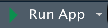
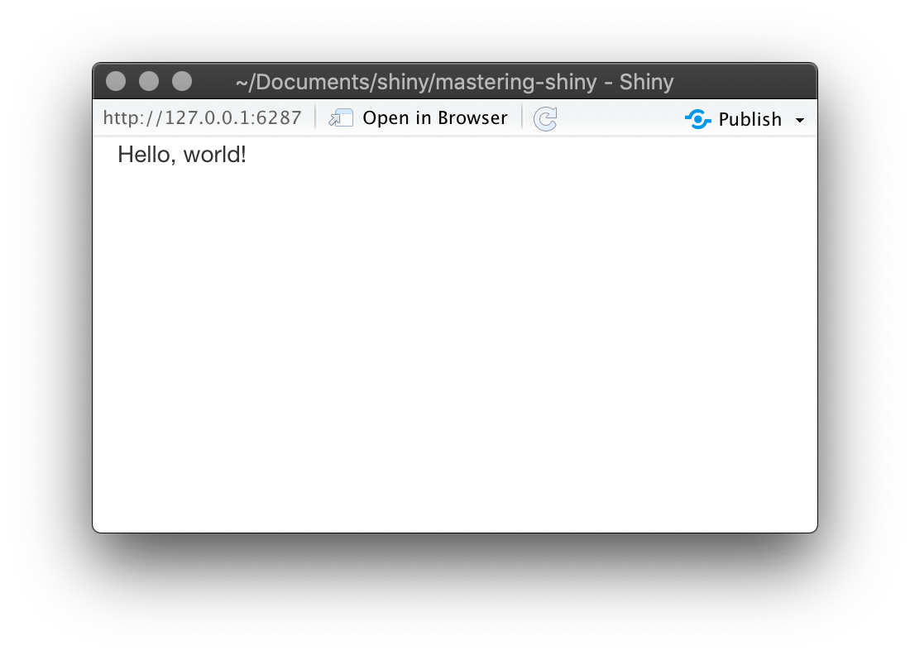

# Your first Shiny app {#basic-app}

```{r, include = FALSE}
source("common.R")
source("demo.R")
```

## Introduction

In this chapter, we'll create a simple Shiny app.
I'll start by showing you the minimum boilerplate needed for a Shiny app, and then you'll learn how to start and stop it.
Next you'll learn the two key components of every Shiny app: the **UI** (short for user interface) which defines how your app *looks*, and the **server function** which defines how your app *works*.
Shiny uses **reactive programming** to automatically update outputs when inputs change so we'll finish off the chapter by learning the third important component of Shiny apps: reactive expressions.

If you haven't already installed Shiny, install it now with:

```{r, eval = FALSE}
install.packages("shiny")
```

If you've already installed Shiny, use `packageVersion("shiny")` to check that you have version 1.6.0 or greater.

Then load in your current R session:

```{r setup}
library(shiny)
```

## Create app directory and file {#create-app}

There are several ways to create a Shiny app.
The simplest is to create a new directory for your app, and put a single file called `app.R` in it.
This `app.R` file will be used to tell Shiny both how your app should look, and how it should behave.

Try it out by creating a new directory, and adding an `app.R` file that looks like this:

```{r eval = FALSE}
library(shiny)
ui <- fluidPage(
  "Hello, world!"
)
server <- function(input, output, session) {
}
shinyApp(ui, server)
```

This is a complete, if trivial, Shiny app!
Looking closely at the code above, our `app.R` does four things:

1.  It calls `library(shiny)` to load the shiny package.

2.  It defines the user interface, the HTML webpage that humans interact with.
    In this case, it's a page containing the words "Hello, world!".

3.  It specifies the behaviour of our app by defining a `server` function.
    It's currently empty, so our app doesn't *do* anything, but we'll be back to revisit this shortly.

4.  It executes `shinyApp(ui, server)` to construct and start a Shiny application from UI and server.

::: {.rmdnote}
**RStudio Tip**: There are two convenient ways to create a new app in RStudio:

-   Create a new directory and an `app.R` file containing a basic app in one step by clicking **File \| New Project**, then selecting **New Directory** and **Shiny Web Application**.

-   If you've already created the `app.R` file, you can quickly add the app boilerplate by typing "shinyapp" and pressing Shift+Tab.
:::

## Running and stopping {#running}

There are a few ways you can run this app:

-   Click the **Run App** (Figure \@ref(fig:run-app)) button in the document toolbar.

-   Use a keyboard shortcut: `Cmd/Ctrl` + `Shift` + `Enter`.

-   If you're not using RStudio, you can `(source())`[^basic-app-1] the whole document, or call `shiny::runApp()` with the path to the directory containing `app.R`.

[^basic-app-1]: The extra `()` on the outside are important.
    `shinyApp()` only creates an app when printed, and `()` forces the printing of the last result in the file being source, which is otherwise returned invisibly.

```{r run-app, out.width = NULL, echo = FALSE, fig.cap = "The Run App button can be found at the top-right of the source pane."}

```

Pick one of these options, and check that you see the same app as in Figure \@ref(fig:hello-world).
Congratulations!
You've made your first Shiny app.

```{r hello-world, out.width = NULL, echo = FALSE, fig.cap = "The very basic shiny app you'll see when you run the code above"}

```

Before you close the app, go back to RStudio and look at the R console.
You'll notice that it says something like:

```{r}
#> Listening on http://127.0.0.1:3827
```

This tells you the URL where your app can be found: 127.0.0.1 is a standard address that means "this computer" and 3827 is a randomly assigned port number.
You can enter that URL into any compatible[^basic-app-2] web browser to open another copy of your app.

[^basic-app-2]: Shiny strives to support all modern browsers, and you can see the set currently supported at <https://www.rstudio.com/about/platform-support/>.
    Note that Internet Explorer versions prior to IE11 are not compatible when running Shiny directly from your R session.
    However, Shiny apps deployed on Shiny Server or ShinyApps.io can work with IE10 (earlier versions of IE are no longer supported).

Also notice that R is busy: the R prompt isn't visible, and the console toolbar displays a stop sign icon.
While a Shiny app is running, it "blocks" the R console.
This means that you can't run new commands at the R console until the Shiny app stops.

You can stop the app and return access to the console using any one of these options:

-   Click the stop sign icon on the R console toolbar.

-   Click on the console, then press `Esc` (or press `Ctrl` + `C` if you're not using RStudio).

-   Close the Shiny app window.

The basic workflow of Shiny app development is to write some code, start the app, play with the app, write some more code, and repeat.
If you're using RStudio, you don't even need to stop and re-start the app to see your changes --- you can either press the **Reload app** button in the toolbox or use the `Cmd/Ctrl` + `Shift` + `Enter` keyboard shortcut.
I'll cover otherworkflow patterns in Chapter \@ref(action-workflow).

## Adding UI controls {#adding-ui}

Next, we'll add some inputs and outputs to our UI so it's not *quite* so minimal.
We're going to make a very simple app that shows you all the built-in data frames included in the datasets package.

Replace your `ui` with this code:

```{r}
ui <- fluidPage(
  selectInput("dataset", label = "Dataset", choices = ls("package:datasets")),
  verbatimTextOutput("summary"),
  tableOutput("table")
)
```

This example uses four new functions:

-   `fluidPage()` is a **layout function** that sets up the basic visual structure of the page.
    You'll learn more about them in Section \@ref(layout).

-   `selectInput()` is an **input control** that lets the user interact with the app by providing a value.
    In this case, it's a select box with the label "Dataset" and lets you choose one of the built-in datasets that come with R.
    You'll learn more about inputs in Section \@ref(inputs).

-   `verbatimTextOutput()` and `tableOutput()` are **output controls** that tell Shiny *where* to put rendered output (we'll get into the *how* in a moment).
    `verbatimTextOutput()` displays code and `tableOutput()` displays tables.
    You'll learn more about outputs in Section \@ref(outputs).

Layout functions, inputs, and outputs have different uses, but they are fundamentally the same under the covers: they're all just fancy ways to generate HTML, and if you call any of them outside of a Shiny app, you'll see HTML printed out at the console.
Don't be afraid to poke around to see how these various layouts and controls work under the hood.

Go ahead and run the app again.
You'll now see Figure \@ref(fig:basic-ui), a page containing a select box.
We only see the input, not the two outputs, because we haven't yet told Shiny how the input and outputs are related.

```{r basic-ui, echo = FALSE, out.width = NULL, fig.cap="The datasets app with UI", message = FALSE}
demo <- demoApp$new("basic-app/ui", ui)
demo$takeScreenshot()
```

## Adding behaviour {#server-function}

Next, we'll bring the outputs to life by defining them in the server function.

Shiny uses reactive programming to make apps interactive.
You'll learn more about reactive programming in Chapter \@ref(basic-reactivity), but for now, just be aware that it involves telling Shiny *how* to perform a computation, not ordering Shiny to actually go *do it*.
It's like the difference between giving someone a recipe versus demanding that they go make you a sandwich.

We'll tell Shiny how to fill in the `summary` and `table` outputs in the sample app by providing the "recipes" for those outputs.
Replace your empty `server` function with this:

```{r}
server <- function(input, output, session) {
  output$summary <- renderPrint({
    dataset <- get(input$dataset, "package:datasets")
    summary(dataset)
  })
  
  output$table <- renderTable({
    dataset <- get(input$dataset, "package:datasets")
    dataset
  })
}
```

The left-hand side of the assignment operator (`<-`), `output$ID`, indicates that you're providing the recipe for the Shiny output with that ID.
The right-hand side of the assignment uses a specific **render function** to wrap some code that you provide.
Each `render{Type}` function is designed to produce a particular type of output (e.g. text, tables, and plots), and is often paired with a `{type}Output` function.
For example, in this app, `renderPrint()` is paired with `verbatimTextOutput()` to display a statistical summary with fixed-width (verbatim) text, and `renderTable()` is paired with `tableOutput()` to show the input data in a table.

Run the app again and play around, watching what happens to the output when you change an input.
Figure \@ref(fig:basic-server) shows what you should see when you open the app.

```{r basic-server, echo = FALSE, out.width = "75%", fig.cap = "Now that we've provided a server function that connects outputs and inputs, we have a fully functional app", message = FALSE}
demo <- demoApp$new("basic-app/server", ui, server)
demo$takeScreenshot()
```

Notice that the summary and table update whenever you change the input dataset.
This dependency is created implicitly because we've referred to `input$dataset` within the output functions.
`input$dataset` is populated with the current value of the UI component with id `dataset`, and will cause the outputs to automatically update whenever that value changes.
This is the essence of **reactivity**: outputs automatically *react* (recalculate) when their inputs change.

## Reducing duplication with reactive expressions {#reactive-expr}

Even in this simple example, we have some code that's duplicated: the following line is present in both outputs.

```{r, eval = FALSE}
dataset <- get(input$dataset, "package:datasets")
```

In every kind of programming, it's poor practice to have duplicated code; it can be computationally wasteful, and more importantly, it increases the difficulty of maintaining or debugging the code.
It's not that important here, but I wanted to illustrate the basic idea in a very simple context.

In traditional R scripting, we use two techniques to deal with duplicated code: either we capture the value using a variable, or capture the computation with a function.
Unfortunately neither of these approaches work here, for reasons you'll learn about in Section \@ref(motivation), and we need a new mechanism: **reactive expressions**.

You create a reactive expression by wrapping a block of code in `reactive({...})` and assigning it to a variable, and you use a reactive expression by calling it like a function.
But while it looks like you're calling a function, a reactive expression has an important difference: it only runs the first time it is called and then it caches its result until it needs to be updated.

We can update our `server()` to use reactive expressions, as shown below.
The app behaves identically, but works a little more efficiently because it only needs to retrieve the dataset once, not twice.

```{r, eval = FALSE}
server <- function(input, output, session) {
  # Create a reactive expression
  dataset <- reactive({
    get(input$dataset, "package:datasets")
  })

  output$summary <- renderPrint({
    # Use a reactive expression by calling it like a function
    summary(dataset())
  })
  
  output$table <- renderTable({
    dataset()
  })
}
```

We'll come back to reactive programming multiple times, but even armed with a cursory knowledge of inputs, outputs, and reactive expressions, it's possible to build quite useful Shiny apps!

## Summary

In this chapter you've created a simple app --- it's not very exciting or useful, but seen how easy it is to construct a web app using your existing R knowledge.
In the next two chapters, you'll learn more about user interfaces and reactive programming, the two basic building blocks of Shiny.
Now is a great time to grab a copy of the [Shiny cheatsheet](https://github.com/rstudio/cheatsheets/raw/master/shiny.pdf).
This is a great resource to help jog your memory of the main components of a Shiny app.

```{r cheatsheet, echo = FALSE, out.width = NULL, fig.cap = "Shiny cheatsheet, available from https://www.rstudio.com/resources/cheatsheets/"}
knitr::include_graphics("images/basic-app/cheatsheet.png", dpi = 300)
```

## Exercises

1.  Create an app that greets the user by name.
    You don't know all the functions you need to do this yet, so I've included some lines of code below.
    Think about which lines you'll use and then copy and paste them into the right place in a Shiny app.

    ```{r, eval = FALSE}
    tableOutput("mortgage")
    output$greeting <- renderText({
      paste0("Hello ", input$name)
    })
    numericInput("age", "How old are you?", value = NA)
    textInput("name", "What's your name?")
    textOutput("greeting")
    output$histogram <- renderPlot({
      hist(rnorm(1000))
    }, res = 96)
    ```

2.  Suppose your friend wants to design an app that allows the user to set a number (`x`) between 1 and 50, and displays the result of multiplying this number by 5.
    This is their first attempt:

    ```{r}
    library(shiny)

    ui <- fluidPage(
      sliderInput("x", label = "If x is", min = 1, max = 50, value = 30),
      "then x times 5 is",
      textOutput("product")
    )

    server <- function(input, output, session) {
      output$product <- renderText({ 
        x * 5
      })
    }

    shinyApp(ui, server)
    ```

    But unfortunately it has an error:

    ```{r, echo = FALSE, out.width = NULL, message = FALSE}
    demo <- demoApp$new("basic-app/ex-x-times-5", ui, server)
    demo$takeScreenshot()
    ```

    Can you help them find and correct the error?

3.  Extend the app from the previous exercise to allow the user to set the value of the multiplier, `y`, so that the app yields the value of `x * y`.
    The final result should look like this:.

    ```{r, echo = FALSE, out.width = NULL, message = FALSE}
    ui <- fluidPage(
      sliderInput("x", "If x is", min = 1, max = 50, value = 30),
      sliderInput("y", "and y is", min = 1, max = 50, value = 5),
      "then, x times y is",
      textOutput("product")
    )
    server <- function(input, output, session) {
      output$product <- renderText({ 
        input$x * input$y
      })
      
    }
    demo <- demoApp$new("basic-app/ex-x-times-y", ui, server)
    demo$takeScreenshot()
    ```

4.  Take the following app which adds some additional functionality to the last app described in the last exercise.
    What's new?
    How could you reduce the amount of duplicated code in the app by using a reactive expression.

    ```{r}
    library(shiny)

    ui <- fluidPage(
      sliderInput("x", "If x is", min = 1, max = 50, value = 30),
      sliderInput("y", "and y is", min = 1, max = 50, value = 5),
      "then, (x * y) is", textOutput("product"),
      "and, (x * y) + 5 is", textOutput("product_plus5"),
      "and (x * y) + 10 is", textOutput("product_plus10")
    )

    server <- function(input, output, session) {
      output$product <- renderText({ 
        product <- input$x * input$y
        product
      })
      output$product_plus5 <- renderText({ 
        product <- input$x * input$y
        product + 5
      })
      output$product_plus10 <- renderText({ 
        product <- input$x * input$y
        product + 10
      })
    }

    shinyApp(ui, server)
    ```

5.  The following app is very similar to one you've seen earlier in the chapter: you select a dataset from a package (this time we're using the **ggplot2** package) and the app prints out a summary and plot of the data.
    It also follows good practice and makes use of reactive expressions to avoid redundancy of code.
    However there are three bugs in the code provided below.
    Can you find and fix them?

    ```{r}
    library(shiny)
    library(ggplot2)

    datasets <- c("economics", "faithfuld", "seals")
    ui <- fluidPage(
      selectInput("dataset", "Dataset", choices = datasets),
      verbatimTextOutput("summary"),
      tableOutput("plot")
    )

    server <- function(input, output, session) {
      dataset <- reactive({
        get(input$dataset, "package:ggplot2")
      })
      output$summmry <- renderPrint({
        summary(dataset())
      })
      output$plot <- renderPlot({
        plot(dataset)
      }, res = 96)
    }

    shinyApp(ui, server)
    ```
