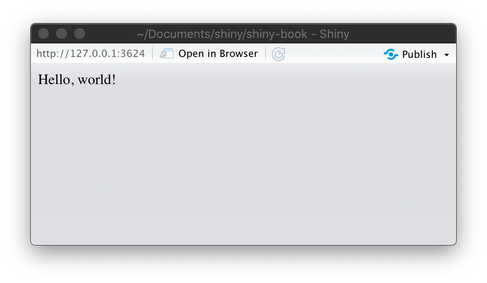

# Your first Shiny app

```{r, include = FALSE}
source("common.R")
```

## Introduction

In this chapter, we'll create a simple Shiny app. Along the way, you'll learn the basic structure of a Shiny app, and how to save and run Shiny apps using the RStudio IDE. You'll also take your first steps into reactive programming.

We'll start by showing you the minimum boilerplate needed to get a Shiny app running, then you'll learn how to run it, and how to stop it when you're done. Next you'll learn the two key components of every shiny app: the **UI** (short for user interface) which defines how your app _looks_, and the **server function** which defines how you app _works_. Shiny uses reactive programming to automatically update app outputs when the inputs change; we'll finish off the chapter by learning the third important reactive component: reactive expressions.

```{r setup}
library(shiny)
```

## Create app dir and file {#create-app}

There are several ways to create a Shiny app. The simplest is to create a new directory for your app, and put a single file called `app.R` in it. This `app.R` file will be used to tell Shiny both how your app should look, and how it should behave.

(Tip: In RStudio IDE, you can easily create a new directory and `app.R` file in one step using **File | New File | Shiny Web App**.)

Open up the `app.R` file and make its contents look like this:

```{r eval = FALSE}
library(shiny)

ui <- "Hello, world!"

server <- function(input, output, session) {
}

shinyApp(ui, server)
```

This is a complete, if trivial, Shiny app. Looking closely at the code above, our `app.R` does four things:

1.  Calls `library(shiny)` to load the shiny package.

2.  Defines the user interface (or **UI** for short) for our app. 
    In this case, it's nothing but the words "Hello, world!".

3.  Specifies the behavior of our app by defining a `server` function. 
    It's currently empty, but we'll be back to revisit this shortly.
    
4.  Runs `shinyApp(ui, server)` to construct a Shiny application object from 
    the UI object and server function.

## Running and stopping {#running}

Run this Shiny app in RStudio[^not-rstudio] now by pressing `Ctrl+Shift+Enter`, or by clicking the **Run App** button in the document toolbar. You should see a web application launch in a new window, with only the words "Hello, world!":

[^not-rstudio]: If you're not using RStudio, you can use `setwd()` to change the current working directory to the app dir, and call `shiny::runApp()` (or alternatively, don't change the current working directory and pass the path to the app dir to `runApp()` as an argument).

```{r, echo = FALSE, out.width = NULL}

```

This is RStudio's Shiny app window. From here, you can click "Open in Browser" to view the app in your system default web browser, which can be helpful for testing or debugging. If you prefer to always launch straight into your system default web browser, or RStudio's Viewer pane, you can use the Run App button's dropdown menu to choose one of those instead:

```{r, echo = FALSE, out.width = NULL}
knitr::include_graphics("images/basic-app/run-app.png")
```

Before you close the app, go back to your main RStudio window and look at the R console. You'll notice that the console says something like:

```{r}
#> Listening on http://127.0.0.1:3827
```

This is telling you the URL where your app can be found: 127.0.0.1 is a standard address that means "this computer" and 3827 is randomly assigned port number. You can enter that URL into any compatible[^ie] web browser to open another copy of your app.

[^ie]: Notably, Internet Explorer versions earlier than IE11 are not compatible when running Shiny directly from your R session. However, Shiny apps deployed on Shiny Server or ShinyApps.io can work with IE10 (earlier versions of IE are no longer supported).

The second thing to notice is that R is busy: the R prompt isn't visible, and the console toolbar displays a stop sign icon. While a Shiny app is running, it "blocks" the R console. This means that you can't run new commands at the R console until after the Shiny app either stops of its own accord, or (much more commonly) is interrupted.

Go ahead and stop your app using any one of these options:

- Click the stop sign icon on the R console toolbar.

- Press the `Esc` key (Note: the keyboard focus must be in either the RStudio 
  console or editor).

- Close the Shiny app window.

- Non-RStudio users: However you normally interrupt running R code, 
  e.g. `Ctrl+C` or `Esc`.

## Adding UI controls {#adding-ui}

Next, we'll add some inputs and outputs to our UI so it's not *quite* so minimal. Change your `ui` object to look like this:

```{r}
ui <- fluidPage(
  selectInput("dataset", label = "Dataset",
    choices = ls("package:datasets")
  ),
  verbatimTextOutput("summary"),
  tableOutput("table")
)
```

This example uses four functions we haven't seen before.

* `fluidPage()` is one of several **layout functions** which set up the basic 
  visual structure of the page. You'll learn more about them in Section 
  \@ref(layout)
  
* `selectInput()` is an **input control**, which lets the user interact with 
  the app by providing a value. In this case, it's a fancy select box with the 
  title "Dataset" and lets you choose one of the built-in datasets that come 
  with R. You'll learn more about inputs in Section \@ref(inputs).
  
* `verbatimTextOutput()` and `tableOutput()` are **output controls**, that 
  tell Shiny *where* to put rendered output (we'll get into the *how* in a 
  moment). `verbatimTextOutput()` displays code  and `tableOutput` displays 
  tables. You'll learn more about outputs in Section \@ref(outputs).

Layout functions, inputs, and outputs are used for different purposes, but they fundamentally the same under the covers: they're all just fancy ways to generate HTML, and if you call any of them outside of a shiny app, you'll see HTML printed out at the console. Don't be afraid to poke around to see how these various layouts and controls work under the hood. You'll learn more of the details in Chapter \@ref(advanced-ui).

Go ahead and run the app again. You'll now see a select box with a set of names, and very little else. We've defined the UI, but haven't yet told Shiny what data to put in the outputs.

```{r, echo = FALSE, out.width = NULL}
app_screenshot(ui, NULL, "basic-app/ui", height = 300)
```

## Adding behavior {#server-function}

Next, we'll bring the outputs to life by defining them in the server function.

Shiny uses a *reactive programming* framework to make apps interactive. You'll learn more about reactive programming in Chapter \@ref(reactivity-intro), but for now, just be aware that it often involves telling Shiny *how* to perform a computation, not ordering Shiny to actually go *do it*. It's like the difference between giving someone a recipe instead of demanding that they go make you a sandwich.

In this simple case, we're going to tell Shiny how to fill in the `summary` and `table` outputs—we're providing the "recipes" for those outputs. Replace your empty `server` function with this:

```{r}
server <- function(input, output, session) {
  output$summary <- renderPrint({
    dataset <- get(input$dataset, "package:datasets", inherits = FALSE)
    summary(dataset)
  })
  
  output$table <- renderTable({
    dataset <- get(input$dataset, "package:datasets", inherits = FALSE)
    dataset
  })
}
```

Almost every output you'll write in Shiny will follow this same pattern:

```{r, eval = FALSE}
output$IDENTIFIER <- renderTYPE({
  # Expression that generates whatever kind of output
  # renderTYPE expects
})
```

The left-hand side of the assignment operator (`<-`), `output$IDENTIFIER`, indicates that you're providing the recipe for the Shiny output with the matching ID. The right-hand side of the assignment specifies uses a specific *render function* to wrap a code block that you provide; in the example above, we use `renderPrint` and `renderTable` wrap our app-specific logic. 

Each `renderXXX` function is designed to work with a particular type of output that's passed to an `xxxOutput` function. In this case, we're using `renderPrint()` to capture and display the outut from `summary()` output, and `renderTable()` to display the actual data frame in a table.

Run the app again and play around, watching what happens to the output when you change an input.

```{r, echo = FALSE, out.width = NULL}
app_screenshot(ui, server, "basic-app/server", height = 300)
```

**Outputs are *reactive* which means that Shiny automatically knows when to recalculate them.** Because both of the rendering code blocks we wrote read `input$dataset`, whenever the value of `input$dataset` changes (i.e. the user changes their selection in the UI), both outputs will recalculate and update in the browser. Shiny takes care of this detail so that you don't need to worry about it.

## Reducing duplication with reactive expressions {#reactive-expr}

Even in this simple example, we have some code that's duplicated: the line

```{r, eval = FALSE}
dataset <- get(input$dataset, "package:datasets", inherits = FALSE)
```

is present in both outputs. In every kind of programming, it's poor practice to have duplicated code; it can be computationally wasteful, and more importantly, it increases the difficulty of maintaining or debugging the code.

In traditional R scripting, we use two techniques to deal with duplicated code: either we capture the value using a *variable* (if we only need to do the calculation once), or capture the computation itself using a *function* (if we need to perform the calculation multiple times, possibly based on different inputs). 

Unfortunately neither of these approaches work here (for resaons you'll learn about in Section \@ref(reactive-expressions-intro)), and we need new mechnaism: **reactive expressions**, created by wrapping a block of code with `reactive({...})`. You assign the reactive expression object to a variable, and *call the variable like a function* to retrieve its value.

```{r, eval = FALSE}
# Much better
server <- function(input, output, session) {
  dataset <- reactive({
    get(input$dataset, "package:datasets", inherits = FALSE)
  })

  output$summary <- renderPrint({
    summary(dataset())
  })
  
  output$table <- renderTable({
    dataset()
  })
}
```

While it looks like you're calling a function, a reactive expression has an important difference: it only runs its code the first time it is called (e.g. from `renderPrint()` and `renderTable()`), then caches the resulting value until it needs to be updated (for example, if `input$dataset` changed). Once that happens, the next time it's called, it will execute its code again, and cache the resulting value, and so on.

We'll come back to reactive programming multiple times, but even armed with a cursory knowledge of inputs, outputs, and reactive expressions, it's possible to build quite useful Shiny apps!

## Exercises

TODO
