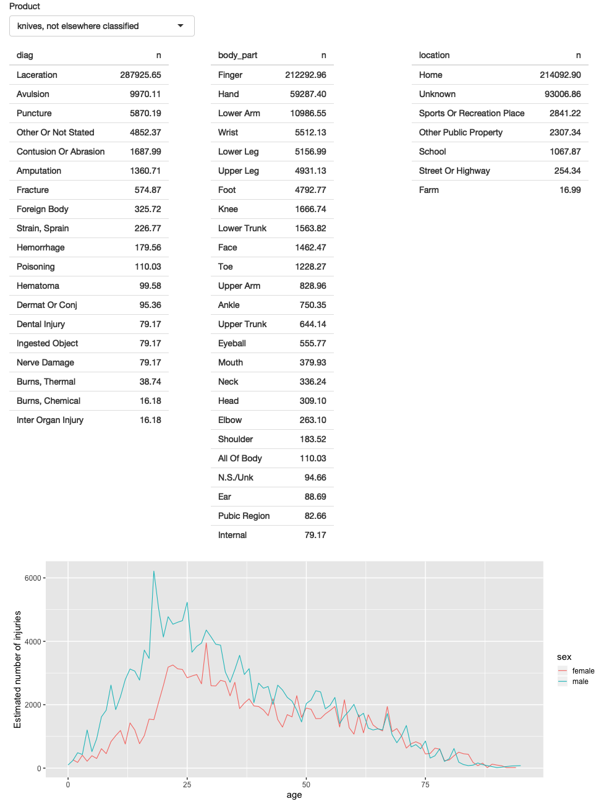

# Case study: emergency room injuries {#basic-case-study}

```{r include=FALSE}
source("common.R")
```

## Introduction

In the last three chapters, we've introduced you to a bunch of new concepts. To help them sink in, we'll now walk through how you might create a shiny app to facilitate the exploration of a datasets.

In this chapter, we're going to supplement Shiny with the tidyverse and vroom packages.

```{r setup, message = FALSE}
library(tidyverse)
library(vroom)
library(shiny)
```

## The data

We're going to explore a year's worth of data from the Data from National Electronic Injury Surveillance System (NEISS). This is a long-term study that captures accidents from a representative probability sample of all hospitals in the United States. Collected by Consumer Product Safety Commission. 

You can find out more about this dataset at <https://github.com/hadley/neiss>, and see the code used to create this extract at <>.

The main dataset we'll look at is `injuries`:

```{r, message = FALSE}
injuries <- vroom::vroom("neiss/injuries.tsv.gz")
injuries
```

* `trmt_date`, date that person was seen in the hospital.
* `age`, `sex`, and `race` give demographic information about the person
* `body_part` and `diag` give information about the injury
* `location` is the place where it occurred
* `prod_code` is the primary product associated with the injury.
* `weight` is statistical weight giving the estimated number of people who
  would suffer this injury if scaled to the entire population of the US.
* `narrative` is a brief story about how the accident occurred.

We'll pair it with two other data frames for additional context: `products` lets us look up the product name from the produce code, and population tells us the total population of the US for each age and sex combination.

```{r, message = FALSE}
products <- vroom::vroom("neiss/products.tsv")
products

population <- vroom::vroom("neiss/population.tsv")
population
```

## Exploration

Let's take a look at the product code associated with the most injuries - 1842, "stairs or steps". First we'll pull out just this subset of the data:

```{r}
selected <- injuries %>% filter(prod_code == 1842)
nrow(selected)
```

And then perform some basic summaries - steps are most often associated with stairs, to the ankle, at home. Note that I'm weighting my counts with the `weight` variable: that allows us to interpret the counts as estimate number across the whole US.

```{r}
selected %>% count(diag, wt = weight, sort = TRUE)

selected %>% count(body_part, wt = weight, sort = TRUE)

selected %>% count(location, wt = weight, sort = TRUE)
```

We can also explore the pattern across age and sex. Here I also standardise by population so we can get the estimate number of injuries per 10,000 people of that age-sex group.

```{r}
summary <- selected %>% 
  count(age, sex, wt = weight) %>% 
  left_join(population, by = c("age", "sex")) %>% 
  mutate(rate = n / population * 1e4)
summary
```

```{r}
summary %>% 
  ggplot(aes(age, n, colour = sex)) + 
  geom_line() + 
  labs(y = "Estimated number of injuries")
```

Interestingly, the number of injuries is much higher for women.

```{r}
summary %>% 
  ggplot(aes(age, rate, colour = sex)) + 
  geom_line(na.rm = TRUE) + 
  labs(y = "Injuries per 10,000 people")
```

There are three broad patterns here: there's a big spike when children are learning to walk, and roughly constant rate from 20 to 70, and then a gradual increase. This pair of plots shows why considering the rate is so important: the number of injuries to older people declines sharply, but that mostly reflects the fact that fewer people are alive. (Note that the rates only go up to age 80; I couldn't find population data for 80-100.)

We can take a look at a random sample of the narratives to see if that holds true:

```{r}
selected %>% 
  sample_n(10) %>% 
  pull(narrative)
```

It would be very nice if we could easily do this exploration for each product code, without having to retype the code. So lets make a shiny app!

## Front-end

I'll start simple with one input (the product code), three tables, and one plot. When thinking about the front-end there's some tension between starting simple, so I can get the basics working before trying something else, and making sure I don't constrain the basic framework of the app too early. I find doing a few sketches with pencil and paper to be a good way to explore the basic structure before committing to the code.

Here I decided to have one row for the inputs (accepting that I'm probably going to add more inputs before this app is done), one row for all three tables (giving each table 4 columns, 1/3 of the 12 column width), and then one row for the plot:

```{r code = section_get("neiss/prototype.R", "ui")}
```

The server function relatively straghtforward: I convert the `selected` and `summary` variables to reactive expressions. This is a reasonable general pattern: you've typically create variables in your data analysis as a way of decomposing the analysis into steps, and avoiding having to recompute things multiple times, and reactive expressions play the same role in Shiny apps. Often it's a good idea to spend a little time cleaning up your analysis code before you start your Shiny app, so you can think about these problems in regular R code, before you add the additional complexity of reactivity.

```{r code = section_get("neiss/prototype.R", "server")}
```

Note in this case `summary` isn't strictly necessary; because it's only used by a single reactive consumer. But it's good practice to keep computing and plotting separate as it makes the flow of the app easier to understand, and will make it easier to generalise in the future.

When prototyping, there's always a tension between doing the minimum amount of work, and planning for the future. Either extreme can be bad: if you design too narrowly, you'll spend a lot of time later on reworking your app; if you design to rigorously, you'll spend a bunch of time on code that later ends up on cutting floor. Getting the balance right is one of the skills of the software engineer, and there are few shortcuts.

```{r, eval = FALSE, include = FALSE}
file.copy("neiss/prototype.R", "neiss/app.R")
app <- shinytest::ShinyDriver$new("neiss")
app_screenshot(app, "basic-case-study/prototype", width = 800, height = 600)
file.remove("neiss/app.R")
```
```{r, out.width = NULL, echo = FALSE}

```

### Polish tables

```{r}
count_top <- function(df, var, n = 5) {
  df %>%
    mutate({{ var }} := fct_lump(fct_infreq({{ var }}), n = n)) %>%
    group_by({{ var }}) %>% 
    summarise(n = as.integer(sum(weight)))
}

server <- function(input, output, session) {
  selected <- reactive(injuries %>% filter(prod_code == input$code))
  
  output$diag <- renderTable(count_top(selected(), diag), width = "100%")
  output$body_part <- renderTable(count_top(selected(), body_part), width = "100%")
  output$location <- renderTable(count_top(selected(), location), width = "100%")

  summary <- reactive({
    selected() %>% 
      count(age, sex, wt = weight) %>% 
      left_join(population, by = c("age", "sex")) %>% 
      mutate(rate = n / population * 1e4)
  })
  
  output$age_sex <- renderPlot({
    summary() %>% 
      ggplot(aes(age, n, colour = sex)) + 
      geom_line() + 
      labs(y = "Estimated number of injuries")
  })
}
```

### Rate vs count

```{r}
ui <- fluidPage(
  fluidRow(
    column(4, 
      selectInput("code", "Product", setNames(products$prod_code, products$title))
    ),
    column(4, selectInput("y", "Y axis", c("count", "rate")))
  ),
  fluidRow(
    column(4, tableOutput("diag")),
    column(4, tableOutput("body_part")),
    column(4, tableOutput("location"))
  ),
  fluidRow(
    column(12, plotOutput("age_sex"))
  )
)

server <- function(input, output, session) {
  selected <- reactive(injuries %>% filter(prod_code == input$code))
  
  output$diag <- renderTable(count_top(selected(), diag), width = "100%")
  output$body_part <- renderTable(count_top(selected(), body_part), width = "100%")
  output$location <- renderTable(count_top(selected(), location), width = "100%")

  summary <- reactive({
    selected() %>% 
      count(age, sex, wt = weight) %>% 
      left_join(population, by = c("age", "sex")) %>% 
      mutate(rate = n / population * 1e4)
  })
  
  output$age_sex <- renderPlot({
    if (input$y == "count") {
      summary() %>% 
        ggplot(aes(age, n, colour = sex)) + 
        geom_line() + 
        labs(y = "Estimated number of injuries")
    } else {
      summary() %>% 
        ggplot(aes(age, rate, colour = sex)) + 
        geom_line(na.rm = TRUE) + 
        labs(y = "Injuries per 10,000 people")
    }
  })
}
```

### Narrative

```{r}
ui <- fluidPage(
  fluidRow(
    column(6, 
      selectInput("code", "Product", setNames(products$prod_code, products$title), width = "100%")
    ),
    column(2, selectInput("y", "Y axis", c("count", "rate")))
  ),
  fluidRow(
    column(4, tableOutput("diag")),
    column(4, tableOutput("body_part")),
    column(4, tableOutput("location"))
  ),
  fluidRow(
    column(12, plotOutput("age_sex"))
  ),
  fluidRow(
    column(2, actionButton("story", "Tell me a story")),
    column(10, textOutput("narrative"))
  )
)

server <- function(input, output, session) {
  selected <- reactive(injuries %>% filter(prod_code == input$code))
  
  output$diag <- renderTable(count_top(selected(), diag), width = "100%")
  output$body_part <- renderTable(count_top(selected(), body_part), width = "100%")
  output$location <- renderTable(count_top(selected(), location), width = "100%")

  summary <- reactive({
    selected() %>% 
      count(age, sex, wt = weight) %>% 
      left_join(population, by = c("age", "sex")) %>% 
      mutate(rate = n / population * 1e4)
  })
  
  output$age_sex <- renderPlot({
    if (input$y == "count") {
      summary() %>% 
        ggplot(aes(age, n, colour = sex)) + 
        geom_line() + 
        labs(y = "Estimated number of injuries")
    } else {
      summary() %>% 
        ggplot(aes(age, rate, colour = sex)) + 
        geom_line(na.rm = TRUE) + 
        labs(y = "Injuries per 10,000 people")
    }
  })
  
  output$narrative <- renderText({
    input$story
    selected() %>% pull(narrative) %>% sample(1)
  })
}
```
