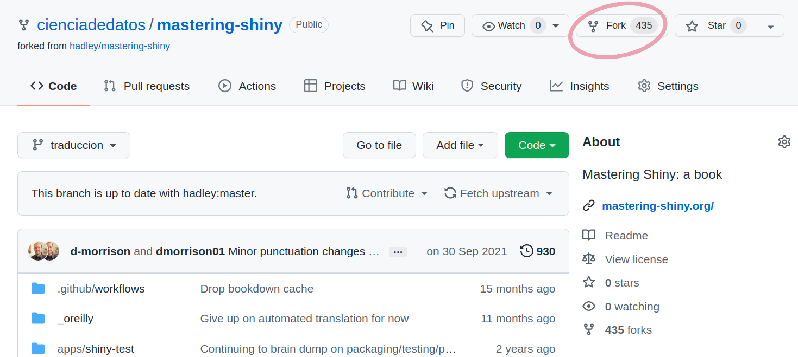
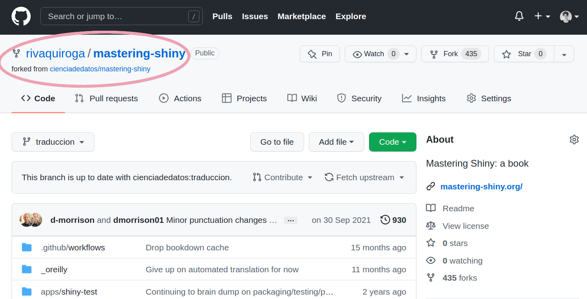
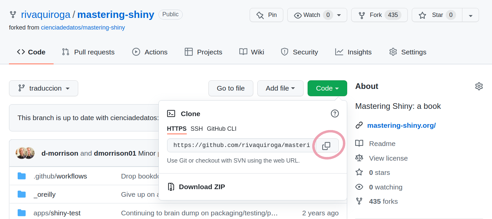
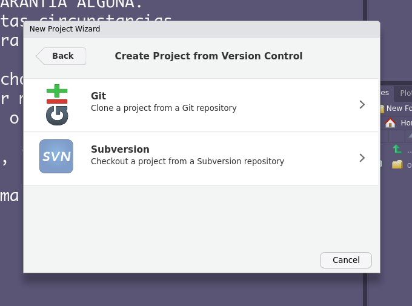
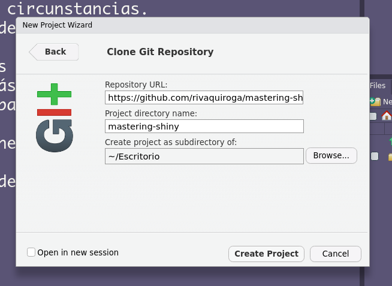
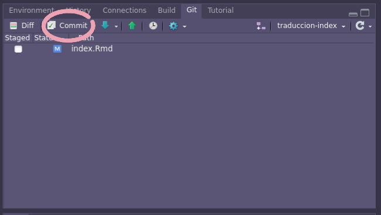
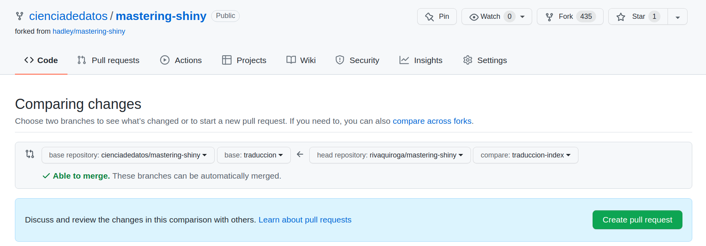
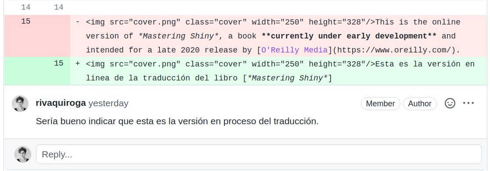
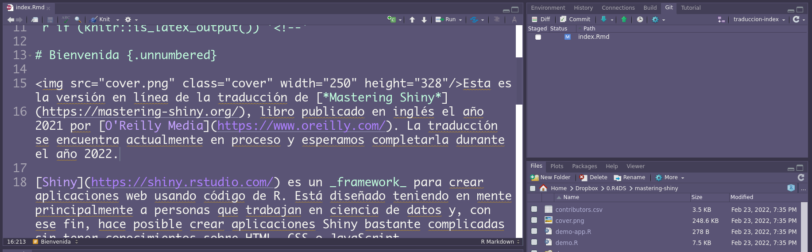
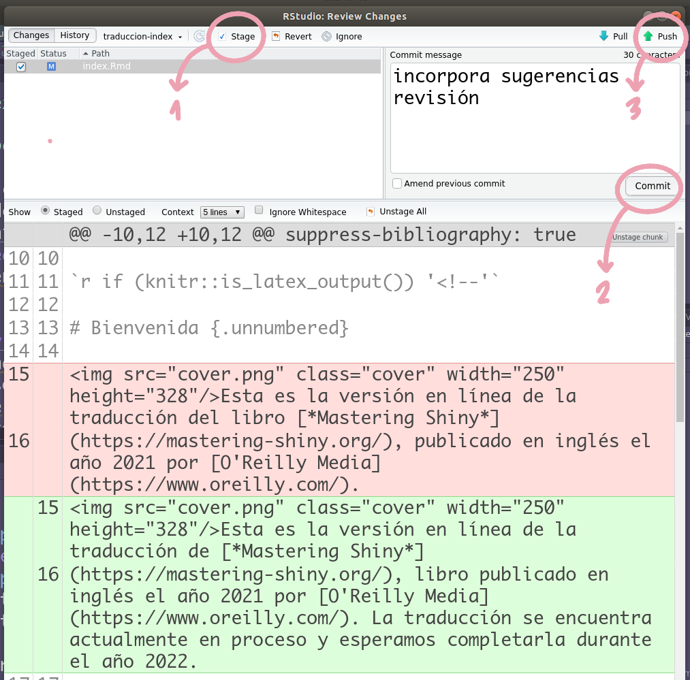

# Cómo colaborar: configuración de GitHub y RStudio para el proceso de traducción

El siguiente documento tiene por objetivo explicar cómo enviar una traducción y cómo editarla durante el proceso de revisión. En la primera parte se explican las configuraciones que debes hacer en GitHub y en RStudio, y luego el paso a paso de cómo crear un _pull request_ para enviar tu capítulo traducido. 

## Requerimientos

* Una cuenta en [GitHub](https://github.com/)
* [Tener instalado Git en tu computador](https://happygitwithr.com/install-git.html)
* Haber habilitado [un token de acceso](https://happygitwithr.com/https-pat.html) en tu computador para poder interactuar con tu cuenta de GitHub
* Asegurarte que [tienes conectado RStudio y Git](https://happygitwithr.com/rstudio-git-github.html)
* Tener instalado el paquete `usethis`

## Configuración inicial

### Paso 1: hacer un _fork_ del repositorio con la traducción del libro

En [https://github.com/cienciadedatos/mastering-shiny](https://github.com/cienciadedatos/mastering-shiny) haz clic en _Fork_ (esquina superior derecha). Esto creará una copia del repositorio principal en tu propia cuenta de GitHub.

<p align="center">

</p>

Si todo sale bien, deberías ver ahora el _fork_ del repositorio principal en tu propia cuenta.

<p align="center">

</p>

### Paso 2: Crea una copia local de tu _fork_

A continuación, necesitas crear una copia local de tu _fork_ en tu computador. Para ello, primero debes copiar la url de tu repositorio. Puedes hacerlo desplegando el botón verde que dice _Code_. 

<p align="center">

</p>

Luego, ya en RStudio, anda a **File > New Project...** y elije la opción _Version Control_. 

<p align="center">

</p>

Luego, selecciona la opción Git.

<p align="center">

</p>

Cuando te pregunte por la url del repositorio, pega la que copiaste anteriormente. Debiese ser algo así: `https://github.com/tu-id-de-github/mastering-shiny.git`. Debes indicar también en qué parte de tu computador quieres guardar esa carpeta.

<p align="center">

</p>

Al hacer clic en "Create" se reiniciará tu sesión de RStudio y verás ahora el proyecto que acabas de crear. Puedes chequear que está todo bien si en la esquina superior derecha dice `mastering-shiny`.

<p align="center">

</p>

### Paso 3: configurar los repositorios remotos

Ejecuta en la consola `usethis::git_remotes()`. Deberías ver un resultado parecido al que sigue, con la diferencia de que la ruta de la carpeta del proyecto será la de tu computador y la url la de tu repositorio.

```
> usethis::git_remotes()
✓ Setting active project to '/home/ciruelo/Escritorio/mastering-shiny'
$origin
[1] "https://github.com/rivaquiroga/mastering-shiny.git"

```

Lo que haremos ahora será agregar como remoto el repositorio principal (el de la cuenta `cienciadedatos`), es decir, aquel en el que se encuentra alojada la traducción. Para ello, ejecuta lo siguiente:

```
usethis::use_git_remote(name = "upstream", url = "https://github.com/cienciadedatos/mastering-shiny.git")
```

Si todo salió bien, al volver a ejecutar `usethis::git_remotes()` deberías ver algo así:


```
> usethis::git_remotes()
$origin
[1] "https://github.com/rivaquiroga/mastering-shiny.git"

$upstream
[1] "https://github.com/cienciadedatos/mastering-shiny.git"

```

Ahora tenemos dos remotos: uno que apunta al que tiene la traducción (_upstream_) y otro a tu _fork_ (_origin_). 

Con este último paso queda todo configurado para que puedas empezar con la traducción.

## Inicia una traducción

Antes de comenzar a traducir, es necesario que te asegures que tu versión local del repositorio está actualizada respecto de la versión de `cienciadedatos`. Este paso es **muy importante** para evitar que se generen conflictos cuando trates de enviar tu traducción. 
La forma más simple de hacer esto es ejecutar `usethis::pr_merge_main()`. Esta función chequeará si hay cambios en el repositorio original y los incorporará a tu fork.

```
> usethis::pr_merge_main()
✓ Pulling changes from 'upstream/traduccion'.
```

Ahora que ya tienes seguridad de que tu repositorio está actualizado respecto del principal, puedes iniciar la traducción. Para ello, crea una rama nueva con la función `usethis::pr_init()`, utilizando como patrón para el nombre `traduccion-nombredelarchivo`. Por ejemplo, si quisiéramos iniciar la traducción del archivo `Index.Rmd`, utilizaríamos `usethis::pr_init("traduccion-index")`.

```
> usethis::pr_init("traduccion-index")
✓ Pulling changes from 'upstream/traduccion'.
✓ Creating and switching to local branch 'traduccion-index'.
• Use `pr_push()` to create a PR.
```

¡Listo! Ya puedes empezar a traducir editando directamente el archivo .Rmd del capítulo correspondiente. Revisa [el documento con las orientaciones para la traducción](https://github.com/cienciadedatos/mastering-shiny/blob/traduccion/documentacion-traduccion/orientaciones-traduccion.md), que contiene los lineamientos que seguiremos durante este proceso.

## Enviar la traducción

Una vez que tengas lista la traducción, haz _commit_ a tu avance en el panel de Git disponible en RStudio. El único archivo que debería aparecerte es el .Rmd que acabas de traducir. (Si te aparece otro, significa que hiciste alguna modificación que sería mejor no incluir en el _pull request_ que vas a crear ahora.)
En el panel de Git, haz clic en "Commit".

<p align="center">

</p>

Se abrirá una nueva ventana. Selecciona ahí el archivo que tradujiste (solo ese) y luego haz clic en "Stage". Escribe un mensaje para tu commit y haz clic en Commit. 

<p align="center">

</p>

Finalmente, en ejecuta en la consola `usethis::pr_push()`

Ese comando abrirá tu navegador y te mostrará la comparación entre tu archivo y el que se encuentra actualmente en el repositorio.

<p align="center">

</p>

Chequea que las dos ramas que se están comparando son la de `cienciadedatos` y la de tu fork. A la izquierda como _base repository_ debe aparecer `cienciadedatos/mastering-shiny` y como _base_ `traduccion`. A la derecha como _head repository_ deberías ver tu fork y como _compare_ la rama que creaste para tu traducción. 
Si todo se ve bien, haz clic en el botón verde "Create Pull Request". Al _pull request_ ponle como nombre "Traducción" + el nombre del archivo. Por ejemplo: "Traducción Index.Rmd".


## Revisión e incorporación de cambios

La revisión de los archivos la haremos directamente en GitHub. Quienes revisen tu traducción hará los comentario en las líneas correspondientes directamente en el _pull request_, como se muestra en el siguiente ejemplo:

<p align="center">

</p>

Una vez que el archivo haya sido comentado, debes incorporar los cambios en tu archivo local en RStudio. 

<p align="center">

</p>

Cuando hayas completado la edición, solo debes volver a hacerle _commit_ a tu trabajo y luego hacer _push_ para que los cambios se envíen a tu pull request. Para ello, haz clic en la flecha verde en tu panel de Git, luego de hacer el _commit_. 

<p align="center">

</p>

¡Listo! Puede que este último paso lo tengas que repetir un par de veces en caso de que haya más de una ronda de revisión. 


