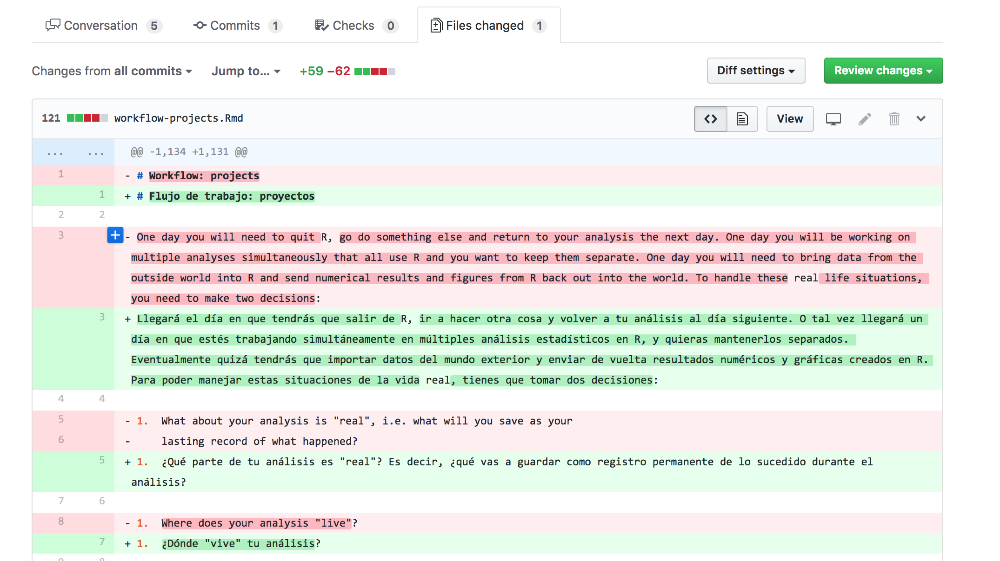
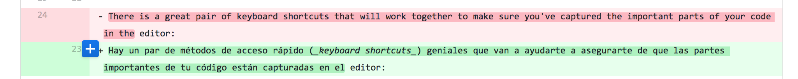
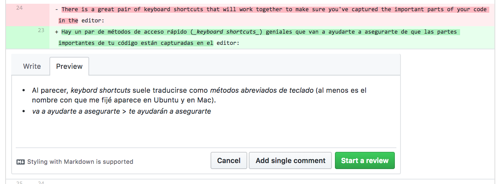

## Orientaciones para la revisión de la traducción de "Mastering Shiny"

¡Muchas gracias por participar revisando traducciones!

A continuación se presentan algunas indicaciones para el proceso:

- Este proyecto tiene un [Código de conducta](https://github.com/cienciadedatos/descripcion-y-orientaciones/blob/master/README.md). Para participar debes adscribir a lo que en él se plantea.

- El objetivo del proceso de revisión es conseguir la mejor traducción posible para un determinado capítulo. Por lo tanto, lo que se espera es que hagas __sugerencias de mejora__, no que indiques errores sin ninguna propuesta de solución.

- Lo que buscamos en este proyecto es que la traducción sea clara y accesible para un público hispanoparlante amplio. Como las personas que participan en él hablan distintas variantes del español, es natural que haya más de una manera de traducir un determinado fragmento. En ese sentido, más que versiones correctas o incorrectas de la traducción, lo que podemos encontrar al revisar son versiones más o menos extendidas de un término o expresión. Si tienes dudas sobre qué tan común es una determinada palabra o expresión, puedes plantearlo como pregunta en en Slack.

- Antes de revisar, es importante que leas las [orientaciones](https://github.com/cienciadedatos/mastering-shiny/blob/traduccion/documentacion-traduccion/orientaciones-traduccion.md) que siguieron quienes tradujeron los capítulos. Así podrás conocer los acuerdos que se han ido generando a lo largo del proceso.

- Tus comentarios debes dejarlos en el mismo _pull request_ de la traducción.

  - Para ello, debes ir a la pestaña "Files changed": 
  - Cuando encuentres una línea de código sobre la que te gustaría dejar una sugerencia, haz clic sobre `+`: 
  - Se desplegará la opción de dejar un comentario. Una vez que escribas tus sugerencias, haz clic en "Add single comment": 
  - Sigue agregando los comentarios y sugerencias que te parezcan pertinentes. Si tienes dudas sobre algún término, puedes proponer crear un _poll_ en el Slack del proyecto: 
  - Tus comentarios se irán sumando a la sección "Conversation". Esto permitirá que otras personas opinen y que quienes también están revisando ese capítulo vean qué líneas ya fueron comentadas: 

- Una vez que termines tu revisión, deja un comentario en el _pull request_ mencionando a la persona que tradujo y a @rivaquiroga.

- Recuerda que si te surje cualquier duda, puedes plantearla en Slack.

