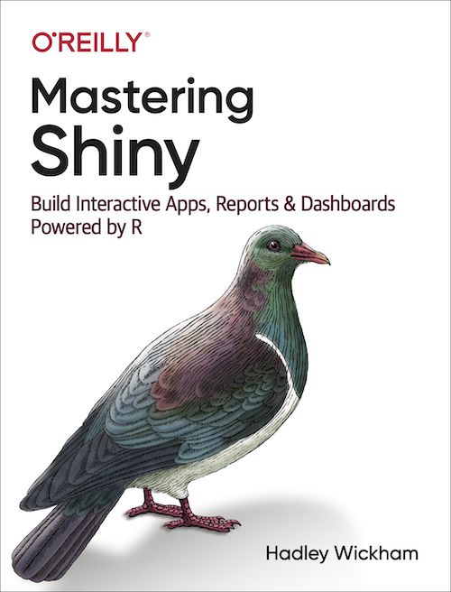

`r if (knitr::is_latex_output()) '<!--'`

# Welcome {.unnumbered}

This is the online version of *Mastering Shiny* by Hadley Wickham, published by [O'Reilly Media](https://www.oreilly.com/) in April 2021.

[Shiny](https://shiny.rstudio.com/) is a framework for creating web applications using R code.
It is designed primarily with data scientists in mind, and to that end, you can create pretty complicated Shiny apps with no knowledge of HTML, CSS, or JavaScript.
On the other hand, Shiny doesn't limit you to creating trivial or prefabricated apps: its user interface components can be easily customized or extended, and its server uses reactive programming to let you create any type of back end logic you want.
Shiny is designed to feel almost magically easy when you're getting started, and yet the deeper you get into how it works, the more you realize it's built out of general building blocks that have strong software engineering principles behind them.

Today, Shiny is used in almost as many niches and industries as R itself is.
It's used in academia as a teaching tool for statistical concepts, a way to get undergrads excited about learning to write code, a splashy medium for showing off novel statistical methods or models.
It's used by big pharma companies to speed collaboration between scientists and analysts during drug development.
It's used by Silicon Valley tech companies to set up realtime metrics dashboards that incorporate advanced analytics.

This book is designed to take you from knowing nothing about Shiny to being an expert developer who can write large complex apps that are still maintainable and performant.
You'll gain a deep understanding of the reactive programming model that underlies Shiny, as well as building a tool box of useful techniques to solve common app challenges.

## License {.unnumbered}

This book is licensed to you under [Creative Commons Attribution-NonCommercial-NoDerivatives 4.0 International License](http://creativecommons.org/licenses/by-nc-nd/4.0/).

The code samples in this book are licensed under [Creative Commons CC0 1.0 Universal (CC0 1.0)](https://creativecommons.org/publicdomain/zero/1.0/), i.e. public domain.

`r if (knitr::is_latex_output()) '-->'`
