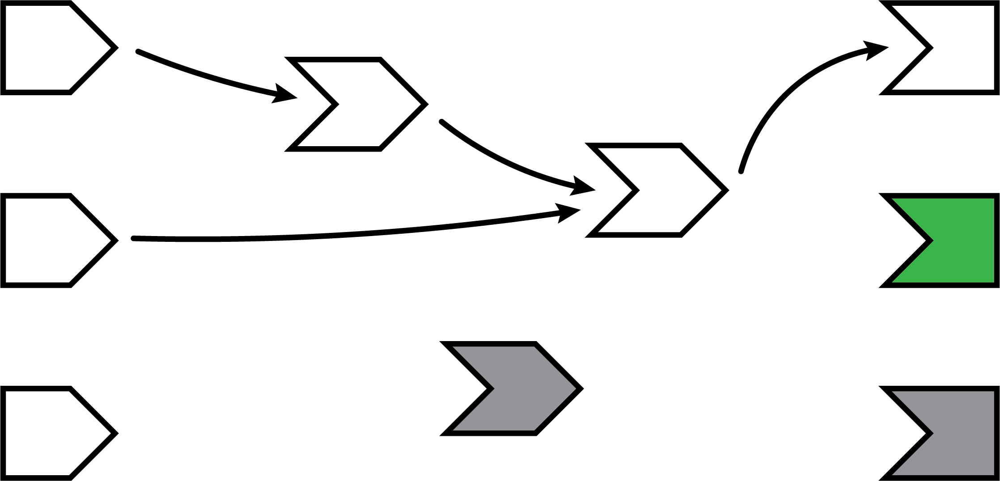
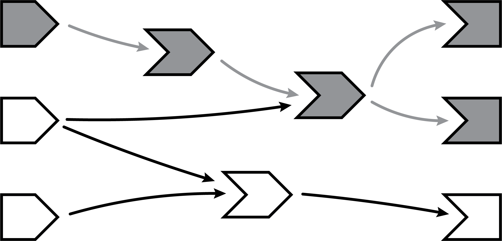
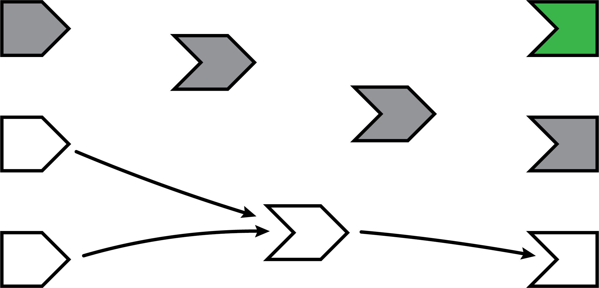

# The reactive graph {#dependency-tracking}

```{r include=FALSE}
source("common.R")
```

## Introduction

As we discussed in Chapter \@ref(basic-reactivity), to understand the order of computation in reactive programming you must understand the reactive graph.
In this chapter, we'll dive in to the details of the graph, paying much more attention to the details.
In particular, you'll learn about the importance of the invalidation, which plays a key role in ensuring that Shiny does the minimum amount of work needed.
You'll also learn about the reactlog package which automatically draws the reactive graph for a live Shiny app.

Before you read this chapter, I highly recommend that you re-read Chapter \@ref(basic-reactivity) if it's been a while since you looked at it.
That chapter lays the ground work for the concepts that we'll explore in more detail.

## A step-by-step tour of reactive execution {#step-through}

Here's an illustrated version of a reactive graph.

```{r echo=FALSE,out.width="70%"}
knitr::include_graphics("images/reactivity-tracking/reactivity-graph-00.png")
```

The lines between the shapes are directional, with the arrows indicating the direction of reactivity.
The direction might surprise you as it's easy to think about a reactive consumer depending on reactive producers, but in a moment we'll see why this is a suboptimal mental model.

Now we'll follow along, step by step, as a Shiny app is loaded and these reactive relationships are discovered, formed, destroyed, and reformed.

### A session begins

When a reactive app is visited and a session begins, the server function is executed and the reactive objects are created.
However, Shiny has no *a priori* knowledge of the relationships (lines) between the objects.
As you can see in the following diagram, the shapes are all present but there are no lines yet.

```{r echo=FALSE,out.width="70%"}
knitr::include_graphics("images/reactivity-tracking/reactivity-graph-01.png")
```

Note that all of the reactive expressions and observers are a darker color.
This indicates that they are in *invalidated* state, which is the initial state for these objects.
When an observer is in this state, it means it needs to be executed as soon as Shiny has a chance to.
When a reactive expression is in this state, it means that the next time that reactive expression is read, its code will need to be executed (i.e., no result value is currently cached for that reactive expression).

### Execution begins

Now that the session has been initialized, we can begin the execution phase.
In this phase, Shiny picks an invalidated observer (*not* a reactive expression) and starts executing it.
In the diagrams below, we use a green fill to indicate when a node is actively executing.

```{r echo=FALSE,out.width="70%"}
knitr::include_graphics("images/reactivity-tracking/reactivity-graph-02.png")
```

You might wonder how Shiny decides which of the invalidated observers/outputs to execute.
In short, you should act as if it's random.
Ideally, your observers and especially outputs won't care what order they execute in, because they've been designed to function independently[^reactivity-tracking-1].

[^reactivity-tracking-1]: If have observers whose side effects must happen in a certain order, you're generally better off re-designing your system.
    Failing that, you can control the relative order of observers with the the `priority` argument to `observe()`.

### Reading a reactive expression

During an observer's execution, it may read from one or more reactive producers.
As soon as this occurs, a relationship is established between the reactive consumer and producer, represented below by the arrow.
The arrow points from left to right; this is the direction that reactivity will flow, as we'll see in a moment.

All reactive expressions start out in invalidated state (represented by the grey fill), including the one this observer is now trying to access.
So in order to return a value, the reactive expression needs to execute its code, which it starts doing now.
We now colour the reactive expression green to represent that it's running.

```{r echo=FALSE,out.width="70%"}
knitr::include_graphics("images/reactivity-tracking/reactivity-graph-03.png")
```

Note that the observer is still green: just because the reactive expression is now running, doesn't mean that the observer has finished.
The observer is waiting on the reactive expression to return its value so its own execution can continue, just like a regular function call in R.

### Reading an input

This particular reactive expression happens to read a reactive input.
Again, a dependency/dependent relationship is established, so we add another arrow.
Unlike reactive expressions and observers, reactive inputs have nothing to execute, since they simply represent a variable.
So the input doesn't turn green, it just immediately returns its current value.

```{r echo=FALSE,out.width="70%"}
knitr::include_graphics("images/reactivity-tracking/reactivity-graph-04.png")
```

### Reactive expression completes

In our example, the reactive expression reads another reactive expression, which in turn reads another input.
We'll skip over the blow-by-blow description of those steps, since they're just a repeat of what we've already described.

When the reactive expression has completed executing, it saves (caches) the resulting value internally before returning it to the observer that requested it.
Now that the reactive expression has finished executing, it's no longer in invalidated (grey) or running (green) state; rather, it's in idle (white) state.
When a reactive expression reaches this state, it means it's up-to-date and will not re-execute its code; instead, it will instantly return the cached value.

```{r echo=FALSE,out.width="70%"}
knitr::include_graphics("images/reactivity-tracking/reactivity-graph-05.png")
```

### Observer completes

Now that the reactive expression has returned its value to the observer, the observer can complete executing its code.
When this has completed, it too enters the idle state, so we change its fill color to white.

```{r echo=FALSE,out.width="70%"}
knitr::include_graphics("images/reactivity-tracking/reactivity-graph-06.png")
```

### The next observer executes

Now that Shiny has completed execution of the first observer, it chooses a second one to execute.
Again, it turns green, and starts reading values from reactives.
Complete reactives can return their values immediately; invalidated reactives will kick of their own execution graph.
This cycle will repeat until every invalidated observer enters the idle (white) state.

```{r echo=FALSE,out.width="70%"}

```

### Execution completes, outputs flushed

At last, all of the observers have finished execution and are now idle.
This round of reactive execution is complete, and nothing will happen with this session until some external force acts on the system (e.g. the user of the Shiny app moving a slider in the user interface).
In reactive terms, this session is now at rest.

I didn't mention it before, but when Shiny outputs finish executing, they don't immediately update the output in the browser.
Instead, all of the new outputs are held until this point, at which time they are "flushed" to the browser all at once[^reactivity-tracking-2].

[^reactivity-tracking-2]: It'd be nice if Shiny could let the app author decide whether outputs update one by one or all at once, but as of this writing, Shiny only supports the latter.

```{r echo=FALSE,out.width="70%"}
knitr::include_graphics("images/reactivity-tracking/reactivity-graph-08.png")
```

Let's stop here for just a moment and think about what we've done.
We've read some inputs, calculated some values, and generated some outputs.
But more importantly, in the course of doing that work, we also discovered the *relationships* between these different calculations and outputs.
An arrow from a reactive input to a reactive expression tells us that if the reactive input's value changes, the reactive expression's result value can no longer be considered valid.
And an arrow from a reactive expression to an output means that if the reactive expression's result is no longer valid, then the output's previous result needs to be refreshed.

Just as important: we also know which nodes are *not* dependent on each other.
If no path exists from a particular reactive input to a particular output (always traveling in the direction that the arrows are pointing), then a change to that input couldn't possibly have an effect on that output.
That gives us the ability to state with confidence that we don't need to refresh that output when that input changes, which is great--the less work we need to do, the sooner we can get results back to the user.

### An input changes

The previous step left off with our Shiny session in a fully idle state.
Now imagine that the user of the application changes the value of a slider.
This causes the browser to send a message to their server, instructing Shiny to update the corresponding reactive input.

When a reactive input or value is modified, it kicks off an *invalidation phase*, which we haven't seen up to this point.
The invalidation phase starts at the changed input/value, which we'll fill with grey, our usual color for invalidation.

```{r echo=FALSE,out.width="70%"}
knitr::include_graphics("images/reactivity-tracking/reactivity-graph-09.png")
```

### Notifying dependents

Now, we follow the arrows that we drew earlier.
Each reactive expression and observer that we come across is put into invalidated state, then we continue following the arrows out of that node.
As a refresher, for observers, the invalidated state means "should be executed as soon as Shiny gets a chance", and for reactive expressions, it means "must execute the next time its value is requested".

In this diagram, the arrows in the lighter shade indicate the paths we took from the changed reactive input through the reactive graph.
Note that we can only traverse the arrows in their indicated direction; it's impossible to move from a reactive expression leftwards to a reactive input, for example.

```{r echo=FALSE,out.width="70%"}

```

### Removing relationships

Next, each invalidated reactive expression and observer "erases" all of the arrows coming in or out of it.
You can think of each arrow as a one-shot notification that will fire the next time a value changes.
Not *every* time, just *the next* time.
So all of the arrows coming *out* of a reactive expression are safe to erase; like a used bottle rocket, they've fired their one shot.

(Less obvious is why we erase the arrows coming *in* to an invalidated node, even if the node they're coming from isn't invalidated. While those arrows represent notifications that haven't yet fired, the invalidated node no longer cares about them. The only reason nodes care about notifications is so they can be invalidated; well, that invalidation has already happened due to some other dependency.)

```{r echo=FALSE,out.width="70%"}
knitr::include_graphics("images/reactivity-tracking/reactivity-graph-11.png")
```

It may seem perverse that we put so much value on those relationships, and now we're going out of our way to erase them!
But the truth is, though these particular arrows *were* important, they are now themselves out of date.
The only way to ensure that our graph stays accurate is to erase arrows when they become stale, and let Shiny rediscover the relationships around these nodes as they reexecute.

This marks the end of the invalidation phase.

### Reexecution

Now we're in a pretty similar situation to when the Shiny session first started; we have some invalidated reactive expressions and outputs, and we don't have any arrows coming in or out of them.
It's time to do exactly what we did then: execute the invalidated outputs/observers, one at a time.

```{r echo=FALSE,out.width="70%"}

```

What's different this time, though, is that not all of the reactive expressions and outputs are starting out in the invalidated state.
Some parts of the graph weren't affected--neither directly nor indirectly--by the reactive input that had changed.
That's great, as we won't need to reexecute those parts of the graph, even if they are used again by some of the invalidated parts!

It's also possible that some outputs are no longer visible, and if so they won't be updated.

## The react log

<https://rstudio.github.io/reactlog/>

Can set `label` to make it easier to identify key reactives.
A handy tip is to use emoji.

## Applications

### Conditional dependency

Consider the following simple app:

```{r}
library(shiny)

ui <- fluidPage(
  selectInput("choice", "A or B?", c("a", "b")),
  numericInput("a", "a", 0),
  numericInput("b", "b", 10),
  textOutput("out")
)

server <- function(input, output, session) {
  output$out <- renderText({
    if (input$choice == "a") {
      input$a
    } else {
      input$b
    }
  }) 
}
```

What does the reactive graph to look like?
You might expect to look like this:

But in fact, the graph either looks like this or that, depending on the value of `input$choice`.

This is because shiny dynamically constructs the graph.

Also happens for observers.

```{r}
server <- function(input, output, session) {
  observe({
    if (input$choice == "a") {
      print(input$a)
    } else {
      print(input$b)
    }
  }) 
}
```

### Nested observers

Every time it activates you get one more:

```{r, eval = FALSE}
x <- reactiveVal(1)
y <- observe({
  x()
  observe(print(x()))
})
x(2)
x(3)
```

Not usually this obvious --- same problem occurs whenever you nest an observer in an output function or a output function in an observer.
Might be hard to spot if you have very large blocks --- just another reason to keep your reactive code as minimal as possible.

## How does it work? {#how-it-works}

Before we carry on, I wanted to give you a quick sense of how things work behind the scenes.
This knowledge isn't likely to help you build better apps, but it might resolve some lingering questions.
Take this simple example:

```{r eval = FALSE}
output$plot <- renderPlot({
  plot(head(cars, input$rows))
})
```

How does Shiny know that `output$plot` reads `input$rows`?
Your first guess might be that `renderPlot()` parses its code looking for looking for symbols that seem to be relevant for reactivity.
This is a natural guess because it's how you build up a reactive graph when reading code.

Unfortunately, however, this technique is very fragile because even a change as simple as giving `input` a new name would break things:

```{r eval = FALSE}
output$plot <- renderPlot({
  x <- input
  plot(head(cars, x$rows))
})
```

In compute science this approach is called **static analysis**, because it looks at the code without running it (i.e. it's not moving, it's static).
Instead, Shiny uses **dynamic instrumentation**, where collects additional information about what's going on as it is run.

The basic process is something like this.
`renderPlot()` starts by creating a **reactive context**.
A reactive context is a internal object that is used coordinate reactive consumers and producers.
You'll never see once of these objects as an app author, but they're a crucial piece of infrastructure behind the scenes.

The reactive context is then stored in a special place that's accessible to other Shiny functions.
Once `renderPlot()` is done, it restores the previous context, using something like this imaginary code:

```{r eval=FALSE}
# renderPlot() creates and activate new context 
context <- ReactiveContext$new()
old <- setReactiveContext(context)

# Then we run the user code
plot(head(cars, input$rows))

# And finally restore the previous context
setReactiveContext(old)
```

Now, while a reactive consumer is running, reactive producers can get hold of the active context with `getReactiveContext()`.
Then when the reactive producer is asked for a value, as well as return the value, it also saves the current reactive context.
When the reactive producer is later modified, it iterates through all its saved contexts and invalidates them.
This then invalidates the corresponding reactive consumers.

So Shiny "magically" establishes the connections between producer and consumer with these two simple mechanisms:

-   Each reactive consumer creates a context object and "activates" it during execution.

-   Each reactive producer augments every read operation by saving the context object so it can be later invalidated.

This process ensures that there's no way that Shiny can either accidentally overlook a reactive dependency relationship or erroneously establish a dependency that doesn't exist.
