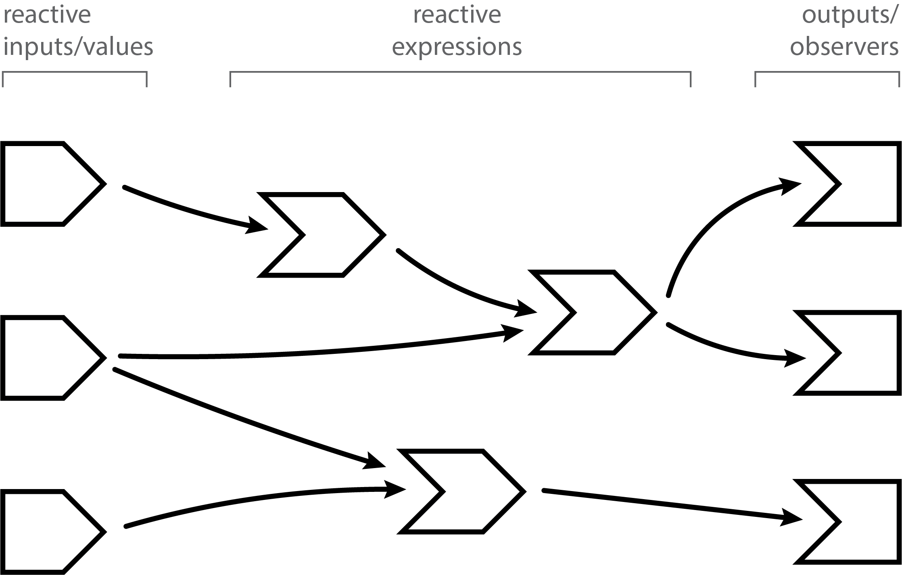
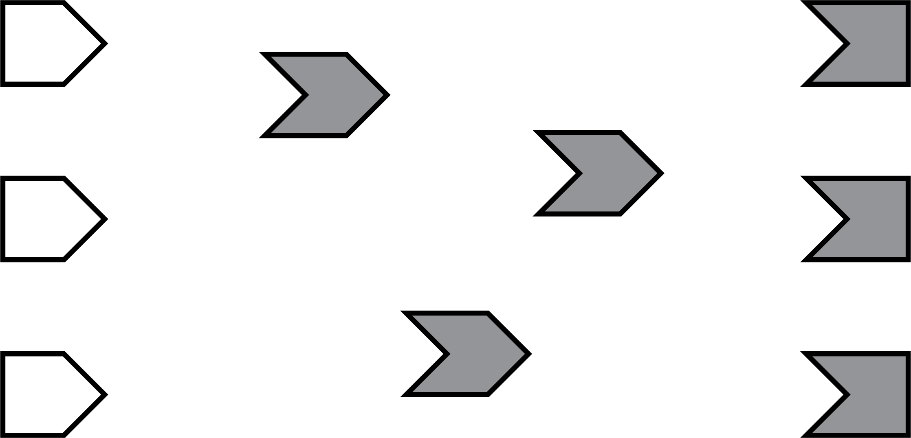

# Dependency tracking {#dependency-tracking}

```{r include=FALSE}
source("common.R")
```

<!-- TODO: redraw diagrams in omnigraffle with reactlog colours -->

## How dependency tracking works

The most striking aspect of reactive programming in Shiny is that a reactive expression, observer, or output "knows" which reactive values/inputs and reactive expressions it depends on. For example:

```{r eval=FALSE}
output$plot <- renderPlot({
  plot(head(cars, input$rows))
})
```

When people are first exposed to Shiny code like this, the most common question is, "How does Shiny know that `output$plot` reads `input$rows`?" And the most common guess is that Shiny parses the body of the `renderPlot()` code block, looking for symbols that seem to be relevant for reactivity, the same way a human being would. If that strikes you as a fragile approach, I agree. Even a change as simple as giving `input` a new name would break things:

```{r eval=FALSE}
output$plot <- renderPlot({
  x <- input
  plot(head(cars, x$rows))
})
```

So, no, that's not the way Shiny works. In computer science, that approach is called __static analysis__, because it looks at the code without running it. Instead, Shiny is using __dynamic instrumentation__, where as the code is run it collects additional information about what's going on.

### Reactive contexts

Before the `plot` output begins executing, it creates an object that's internal to Shiny called a __reactive context__. As an app author, you'll never create or see one of these objects directly, but they're very important in the implementation of Shiny. The reactive context doesn't represent the `plot` output as a whole, but just a single execution of the output. If, over the life of a Shiny session, the plot is (re)rendered a dozen times, then a dozen reactive contexts will have been created.

The Shiny package has a top-level variable (like a global variable, but one only visible to code inside the Shiny package) that is always pointing to the "current" or "active" reactive context. The `plot` output assigns its new context to this variable, then executes its code block, then restores the previous value of the variable. Basically like this code sketch (for illustrative purposes only):

```{r eval=FALSE}
# Create the new context
ctx <- ReactiveContext$new()

# Set as the current context (but save the prev context)
prev_ctx <- shiny:::currentContext
shiny:::currentContext <- ctx

# Actually run user code here
renderPlot({ ... })

# Restore the prev context
shiny:::currentContext <- prev_ctx
```

The purpose of the context object is to provide a rendezvous point between the reactive consumer that is executing, and the reactive producers that it's reading from. There are two important methods on context objects:

1. `invalidate()` - Informs the context that a producer that it read from
    is now potentially out of date (invalidated); and so whatever reactive 
    consumer owns the context should also be considered out of date.

2. `onInvalidated(func)` - Asks the context to invoke the given callback
    function in the future, if and when `invalidate()` is called.

### Intercepting reads

You might be able to see where this is going. While a reactive consumer is executing, it creates a context object and puts it in a globally accessible variable, making it possible for any other code to invalidate that context at any point in the future.

Reactive values and expressions use this context object to connect the dots between reactive dependencies. When a reactive producer is read--using either `input$x` or `up_to_date()`--not only is the appropriate value returned, but a side effect also silently occurs. Each reactive value or expression maintains a list of contexts that depend on its current value being up-to-date; each read of the reactive value or expression causes the current context object to be added to that list.

Each time a reactive value is modified, or a reactive expression is invalidated, it calls `invalidate()` on each dependent context. This invalidates the corresponding reactive consumer objects.

In summary, the way Shiny "magically" establishes the connections between dependency and dependant really comes to these two simple mechanisms: each reactive consumer creates a context object and installs it in a global location during execution, and each reactive producer augments every read operation by grabbing the context object so it can be later invalidated. There is no way that Shiny can accidentally overlook a reactive dependency relationship, or establish one erroneously (though there are a few ways to _instruct_ Shiny to intentionally overlook reactive dependencies, as we'll see later).

## A step-by-step tour of reactive execution {#step-through}

Here's an illustrated version of a reactive graph.

```{r echo=FALSE,out.width="70%"}

```

The lines between the shapes are directional, with the arrows indicating the direction of reactivity--we'll see in a moment why this means the arrows go from left to right, instead of from right to left.

Now we'll follow along, step by step, as a Shiny app is loaded and these reactive relationships are discovered, formed, destroyed, and reformed.

### A session begins

When a reactive app is visited and a session begins, the server function is executed and the reactive objects are created. However, Shiny has no _a priori_ knowledge of the relationships (lines) between the objects. As you can see in the following diagram, the shapes are all present but there are no lines yet.

```{r echo=FALSE,out.width="70%"}

```

Note that all of the reactive expressions and observers are a darker color. This indicates that they are in _invalidated_ state, which is the initial state for these objects. When an observer is in this state, it means it needs to be executed as soon as Shiny has a chance to. When a reactive expression is in this state, it means that the next time that reactive expression is read, its code will need to be executed (i.e., no result value is currently cached for that reactive expression).

### Execution begins

Now that the session has been initialized, we can begin the execution phase. In this phase, Shiny picks an invalidated observer (_not_ a reactive expression) and starts executing it. In the diagrams below, we use a green fill to indicate when a node is actively executing.

```{r echo=FALSE,out.width="70%"}
knitr::include_graphics("images/05-reactivity/reactivity-graph-02.png")
```

(You may wonder how Shiny decides which of the several invalidated observers/outputs to execute. The short answer is that you should act as if it's random. Ideally, your observers and especially outputs won't care what order they execute in, as each will function independently from the others. However, if you do have observers whose side effects must always happen in a certain relative order, you can use the `observe` function's `priority` argument to dictate that order for observers. You can also control the priority of outputs by calling the `outputOptions()` function with a `priority` argument.)

### Reading a reactive expression

During an observer's execution, it may read one or more reactive expressions. As soon as this occurs, a dependency/dependent relationship is established between the reactive expression and the observer, represented below by the arrow. The arrow points from left to right; this is the direction that reactivity will flow, as we'll see in a moment.

As we said, all reactive expressions start out in invalidated state (represented by the grey fill), including the one this observer is now trying to access. So in order to return a value, the reactive expression needs to execute its code, which it starts doing now. We fill the reactive expression with green to represent that it's running.

Note that the observer is still green: just because the reactive expression is now running, doesn't mean that the observer has finished. The observer is waiting on the reactive expression to return its value so its own execution can continue, just like a regular function call in R.

```{r echo=FALSE,out.width="70%"}
knitr::include_graphics("images/05-reactivity/reactivity-graph-03.png")
```

### Reading an input

This particular reactive expression happens to read a reactive input. Again, a dependency/dependent relationship is established, so we add another arrow.

Unlike reactive expressions and observers, reactive inputs have nothing to execute, since they simply represent a variable. So the input doesn't turn green, we just immediately get its current value.

```{r echo=FALSE,out.width="70%"}
knitr::include_graphics("images/05-reactivity/reactivity-graph-04.png")
```

### Reactive expression completes

In our example, the reactive expression reads another reactive expression, which in turn reads another input. We'll skip over the blow-by-blow description of those steps, since they're just a repeat of what we've already described.

When the reactive expression has completed executing, it saves (caches) the resulting value internally before returning it to the observer that requested it. Now that the reactive expression has finished executing, it's no longer in invalidated (grey) or running (green) state; rather, it's in idle (white) state. When a reactive expression reaches this state, it means it's up-to-date and will not re-execute its code; instead, it will instantly return the cached value.

```{r echo=FALSE,out.width="70%"}
knitr::include_graphics("images/05-reactivity/reactivity-graph-05.png")
```

### Observer completes

Now that the reactive expression has returned its value to the observer, the observer can complete executing its code. When this has completed, it too enters the idle state, so we change its fill color to white.

```{r echo=FALSE,out.width="70%"}
knitr::include_graphics("images/05-reactivity/reactivity-graph-06.png")
```

### The next observer executes

Now that Shiny has completed execution of the first observer, it chooses a second one to execute. Again, it turns green, and may read values from invalidated reactive expressions, which will turn green, and so on. This cycle will repeat until every invalidated observer enters the idle (white) state.

```{r echo=FALSE,out.width="70%"}
knitr::include_graphics("images/05-reactivity/reactivity-graph-07.png")
```

### Execution completes, outputs flushed

At last, all of the observers have finished execution and are now idle. This round of reactive execution is complete, and nothing will happen with this session until some external force acts on the system (e.g. the user of the Shiny app moving a slider in the user interface). In reactive terms, this session is now at rest.

I didn't mention it before, but when Shiny outputs finish executing, they don't immediately update the output in the browser. Instead, all of the new outputs are held until this point, at which time they are "flushed" to the browser all at once[^flushing]. 

[^flushing]: It'd be nice if Shiny could let the app author decide whether outputs update one by one or all at once, but as of this writing, Shiny only supports the latter.

```{r echo=FALSE,out.width="70%"}
knitr::include_graphics("images/05-reactivity/reactivity-graph-08.png")
```

Let's stop here for just a moment and think about what we've done. We've read some inputs, calculated some values, and generated some outputs. But more importantly, in the course of doing that work, we also discovered the _relationships_ between these different calculations and outputs. An arrow from a reactive input to a reactive expression tells us that if the reactive input's value changes, the reactive expression's result value can no longer be considered valid. And an arrow from a reactive expression to an output means that if the reactive expression's result is no longer valid, then the output's previous result needs to be refreshed.

Just as important: we also know which nodes are _not_ dependent on each other. If no path exists from a particular reactive input to a particular output (always traveling in the direction that the arrows are pointing), then a change to that input couldn't possibly have an effect on that output. That gives us the ability to state with confidence that we don't need to refresh that output when that input changes, which is great--the less work we need to do, the sooner we can get results back to the user.

### An input changes

The previous step left off with our Shiny session in a fully idle state. Now imagine that the user of the application changes the value of a slider. This causes the browser to send a message to their server, instructing Shiny to update the corresponding reactive input.

When a reactive input or value is modified, it kicks off an _invalidation phase_, which we haven't seen up to this point. The invalidation phase starts at the changed input/value, which we'll fill with grey, our usual color for invalidation.

```{r echo=FALSE,out.width="70%"}
knitr::include_graphics("images/05-reactivity/reactivity-graph-09.png")
```

### Notifying dependents

Now, we follow the arrows that we drew earlier. Each reactive expression and observer that we come across is put into invalidated state, then we continue following the arrows out of that node. As a refresher, for observers, the invalidated state means "should be executed as soon as Shiny gets a chance", and for reactive expressions, it means "must execute the next time its value is requested".

In this diagram, the arrows in the lighter shade indicate the paths we took from the changed reactive input through the reactive graph. Note that we can only traverse the arrows in their indicated direction; it's impossible to move from a reactive expression leftwards to a reactive input, for example.

```{r echo=FALSE,out.width="70%"}
knitr::include_graphics("images/05-reactivity/reactivity-graph-10.png")
```

### Removing relationships

Next, each invalidated reactive expression and observer "erases" all of the arrows coming in or out of it. You can think of each arrow as a one-shot notification that will fire the next time a value changes. Not _every_ time, just _the next_ time. So all of the arrows coming _out_ of a reactive expression are safe to erase; like a used bottle rocket, they've fired their one shot.

(Less obvious is why we erase the arrows coming _in_ to an invalidated node, even if the node they're coming from isn't invalidated. While those arrows represent notifications that haven't yet fired, the invalidated node no longer cares about them. The only reason nodes care about notifications is so they can be invalidated; well, that invalidation has already happened due to some other dependency.)

```{r echo=FALSE,out.width="70%"}
knitr::include_graphics("images/05-reactivity/reactivity-graph-11.png")
```

It may seem perverse that we put so much value on those relationships, and now we're going out of our way to erase them! But the truth is, though these particular arrows _were_ important, they are now themselves out of date. The only way to ensure that our graph stays accurate is to erase arrows when they become stale, and let Shiny rediscover the relationships around these nodes as they reexecute.

This marks the end of the invalidation phase.

### Reexecution

Now we're in a pretty similar situation to when the Shiny session first started; we have some invalidated reactive expressions and outputs, and we don't have any arrows coming in or out of them. It's time to do exactly what we did then: execute the invalidated outputs/observers, one at a time.

```{r echo=FALSE,out.width="70%"}
knitr::include_graphics("images/05-reactivity/reactivity-graph-12.png")
```

What's different this time, though, is that not all of the reactive expressions and outputs are starting out in the invalidated state. Some parts of the graph weren't affected--neither directly nor indirectly--by the reactive input that had changed. That's great, as we won't need to reexecute those parts of the graph, even if they are used again by some of the invalidated parts!

## The react log

## Applications

### Conditional dependency

Consider the following simple app:
  
```{r}
library(shiny)

ui <- fluidPage(
  selectInput("choice", "A or B?", c("a", "b")),
  numericInput("a", "a", 0),
  numericInput("b", "b", 10),
  textOutput("out")
)

server <- function(input, output, session) {
  output$out <- renderText({
    if (input$choice == "a") {
      input$a
    } else {
      input$b
    }
  }) 
}
```

What does the reactive graph to look like? You might expect to look like this:

But in fact, the graph either looks like this or that, depending on the value of `input$choice`.

This is because shiny dynamically constructs the graph.

### Auto-update checkbox

```{r, eval = FALSE}
if (input$autorefresh) {
  invalidateLater(1000)
}
```

