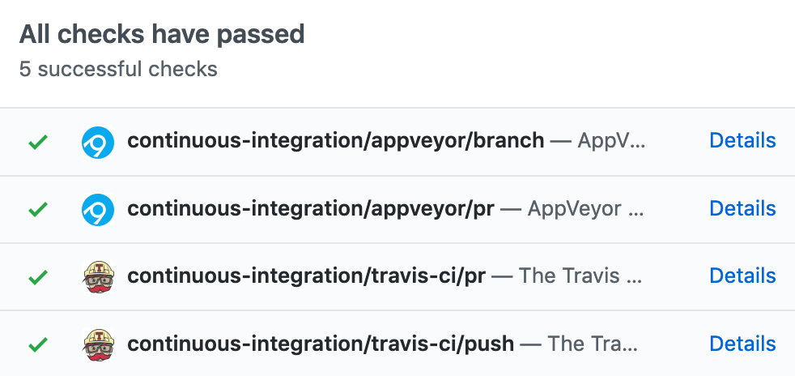

# General guidelines {#best-practices}

When a programmer first gets started with a framework, they're often preoccupied with understanding the fundamentals. Over time, they'll become more comfortable with these concepts which enables them to create larger, more complex applications. Once they do, however, they may find another set of challenges facing them: keeping a complex and growing code-base organized, stable, and maintainable. 

(Thanks to my colleague Jeff Allen for contributing the bulk of this chapter)

Shiny is no different. Early on, you likely spent your time getting comfortable with how to lay out a UI or understanding how reactivity works. As you become more advanced, you'll likely face new problems.

  - "I can't find the code I'm looking for in this huge file."
  - "I haven't worked on this code in 6 months and I'm afraid I'm going to break it if I make any changes."
  - "Someone else started working with me on the application and we keep interfering with each other."
  - "The app works on my computer but doesn't work on my collaborator's or in production."

## Code organization

> Any fool can write code that a computer can understand. Good programmers write code that humans can understand.
>   &mdash; Martin Fowler

One of the most obvious ways to improve the quality of an application is to improve the readability and understandability of its code. The best programmers in the world can't maintain a code-base that they can't understand, so we start here. Good programmers develop empathy for others who will need to interact with this code-base in the future (even if it's just themselves in 6 months!). Like all forms of empathy, this takes practice and becomes easier only after you've done it many times.

Over time, you'll start to notice that certain practices improve the readability of your code. There are no universal rules here, but some general guidelines include:

* Are the variable and function names clear and concise?

* Do I have comments where needed to explain complex bits of code?

* Does this whole function fit on my screen or could it be printed on a single
  piece of paper? If not, is there a way to break it up into smaller pieces?
  
* Am I copying-and-pasting the same block of code many times throughout my app?
  If so, is there a way to use a function or a variable to avoid the repetition?
  
* Are all the parts of my application tangled together, or can I manage the
  different components of my application in isolation?

There's no silver bullet to address all of these points -- and many times they involve subjective judgement calls -- but you should be aware of a couple tools that are at your disposal here.

* Functions: Chapter \@ref(scaling-functions)

* Shiny modules: Chapter \@ref(scaling-modules). 

Most people go through the same evolution with new techniques: "I don't understand them" to "I vaguely understand them but have to look up the syntax every time" to eventually "I understand them and can use them fluidly." It takes time and practice to get to the final stage, but once you get there you'll find that you're able to separate the concerns of your applications much more gracefully. Individual pages or tabs in your application can be constructed as separate Shiny modules, or reused components can be shared by reusing a module instead of copying-and-pasting code.

### Golem

If you've written an R package before, you may have noticed that the way we recommend saving your supplemental R files resembles how R packages are laid out. If you read on to the [testing](#testing) section, you'll notice that test are also saved in a directory structure reminiscent of how R package tests are stored. This is not by accident! We believe that complex Shiny apps can benefit from adopting a format that mirrors R packages.

It's possible to go one step further and actually wrap your Shiny app as an R package itself. There are a wide variety of tools in R that can help build and test R packages, so there are a number benefits that come from organizing your app as a package. The R package [golem](https://thinkr-open.github.io/golem/) offers an opinionated way to structure Shiny apps as R packages and a number of convenience functions that make the process easier. For example, `golem::add_module()` creates a new Shiny module and wires it into your app automatically. If you follow the advice in this article, you'll set yourself up to seamlessly convert your app into its own package using golem should you choose to.

## Source code management

Anyone who's been programming for long has inevitably arrived at a state where they've changed their application in ways that broke things and they now want to roll back to a previous, working state. This can be an incredibly arduous task to do manually. Storing your code in a system that tracks versions of your files is a step in the right direction, as you can at least revert to a previous state. But the best case is to have a system that enables you to atomically commit changes to your code in a descriptive way and also to roll back to previous versions of the code. Having a source code management tool becomes especially imperative if multiple people intend to work on a code-base together.

Git is one such tool that is popular in the R community. There is admittedly a learning curve involved before you can become proficient (or even comfortable), but any experienced developer will confirm that the effort required is well worth it. [Happy Git and GitHub for the useR](https://happygitwithr.com/) is a great resource prepared specifically for R users to become familiar with Git.

## Testing

Developing a test plan for an application is critical to ensure its ongoing stability. Without a test plan, every change jeopardizes the application. When the application is small enough that a single developer can internalize all of the inner-workings in their head, they may feel that there's no need for an additional test plan. However, as soon as that developer steps away from the application for long enough to forget some piece of it, or when another developer needs to contribute to the application, the lack of a test plan will be felt acutely.

A testing plan could be entirely manual. A simple text file that lists all of the operations in the application that need to be tested in order to confirm that a new version of an application is correct would constitute a valid test plan and is a great place to start. However, you'll likely find that the test plan will grow as the application becomes more complex. You'll either spend more and more of your time manually testing the application or you'll start skipping some of the tests with some releases which will eventually come back to bite you. Most applications rely on some combination of automated testing and manual testing; whether or not a test is worth automating comes down to how long you expect to spend manually testing versus how long it would take to automate.

For that reason, various forms of automated testing have been developed for Shiny, as outlined in Chapter \@ref(scaling-testing). As that chapter explains, you can develop:

 - unit tests to confirm the correct behaviour of an individual function,
 - integration tests to confirm the interactions between reactives,
 - functional tests to validate the end-to-end experience from a browser, and
 - load tests to ensure that the application can withstand the amount of traffic you anticipate for it.

 The beauty of writing an automated test is that once you've taken the time to write it, you'll never need to manually test that portion of the application again. You can even leverage continuous integration to run these tests every time you make a change to your code before publishing the application.

## Dependency management

If you've ever tried to reproduce some analysis in R written by someone else, or even tried to rerun some analysis or Shiny application you wrote some time ago, you may have run into trouble around dependencies. An app's dependencies are anything beyond the source code that it requires to run. These could include files on the hard drive, an external database or API, or other R packages that are used by the app. 

For any analysis that you may want to reproduce in the future, consider using [renv](https://rstudio.github.io/renv/) which enables you to create reproducible environments for R. Using renv, you could capture the exact packages that your application requires and even the versions of those packages that were in use initially. That way when you go to restore this application in the future, you can restore the exact version of the R packages that were being used initially. renv also allows you to update your dependencies when you choose to, which means you have the ability to stay current but won't be surprised by package updates that break your application in the coming months and years.

Another tool for managing dependencies is the [config package](https://github.com/rstudio/config). The config package doesn't actually manage dependencies itself, but it does provide a convenient place for you to track and manage other dependencies that your application requires. For instance, you might specify the path to a CSV file that your application depends on, or the URL of an API that you require. Having these enumerated in the config file gives you a single place where you can track and manage these dependencies. Even better, it enables you to create different configurations for different environments. For example, if your application analyzes a database with lots of data, you might choose to configure a few different environments:

* In the production environment, you connect the app to the real "production"
  database.

* In a test environment, you can configure the app to use a test database so
  that you properly exercise the database connections in your tests but you
  don't risk corrupting your production database if you accidentally make 
  a change that corrupts the data.

* In development, you might configure the application to use a small CSV with a
  subset of data to allow for faster iterating.

Lastly, be wary of making assumptions about the local file system. If your code has references to data at `C:\data\cars.csv` or `~/my-projects/genes.rds`, for example, you need to realize that these files won't likely exist at these paths when the app is run on another computer. As mentioned earlier, if you do need to load a file from disk, use the config package to add a reference to make clear that this is a dependency and to allow future users to seamlessly update the path where they have the file stored. You should be sure to document how future users could obtain this file if they don't already have it.

## Continuous integration/deployment (CI, CD)

Once you have source code management and a robust set of automated tests in place, you might benefit from continuous integration (CI). CI is a way to perpetually validate that the changes you're making to your application haven't broken anything. You can use it retroactively (to notify you if a change you've already made broke your application) or proactively (to notify you if a change you're proposing would break before you bring in the change). There are a variety of services that can connect to a Git repo and automatically run tests when you push a new commit or propose changes. Depending on where your code is hosted, you can consider [GitHub actions](https://github.com/features/actions), [Travis CI](https://travis-ci.org/), [Azure Pipelines](https://azure.microsoft.com/en-us/services/devops/pipelines/), [AppVeyor](https://www.appveyor.com/), [Jenkins](https://jenkins.io/), [GitLab CI/CD](https://about.gitlab.com/product/continuous-integration/), or others.

The picture above shows what this looks like when a CI system is connected to GitHub to test proposed changes (called "pull requests", in GitHub). As you can see, all the CI tests show green checks, meaning that all the automated tests passed on this proposed change. If any of the tests had failed, you would be alerted to the failure before you merge the changes into your app. Having a CI process in place helps new contributors have confidence when making changes and eliminates a whole set of concerns from the app's primary author when making changes.

## Code reviews

Many software companies have found the benefits of having a programmer other than the author review code before it gets incorporated into a code-base. The process of "code review" has a number of benefits:

* Catches bugs before they get incorporated into the application making them
  much less expensive to fix.

* Offers teaching opportunities -- programmers at all levels often learn
  something new by reviewing others' code or by having their code reviewed.

* Facilitates cross-pollination and knowledge sharing across a team to 
  eliminate having only one person who understands the app.

* The resulting questions and conversation often improve the readability of
  code.

Typically, a code review involves someone other than the author, but you might benefit from the practice even if you're in an environment in which you don't have anyone else to review your code. Experienced developers will often agree that taking a moment to review their own code before merging it in to the application will often result in them catching something they'd initially overlooked. When you're ready to submit the code, take a few minutes to read through it as a novice Shiny user would. Are there parts of code someone else might find confusing? Are there areas that might need more automated testing to ensure that they're correct and will remain stable moving forward? You might also be able to find someone who isn't currently involved in the app you're writing who would be interested in trading code review services with you.

## Conclusion

Following these principles have helped teams develop large, complex Shiny applications and maintain them over a timespan of many years. You may not find that all of them are a good fit for you right now, but being aware of the different tools that are at your disposal as a Shiny user may help as you work on other applications in other environments.
